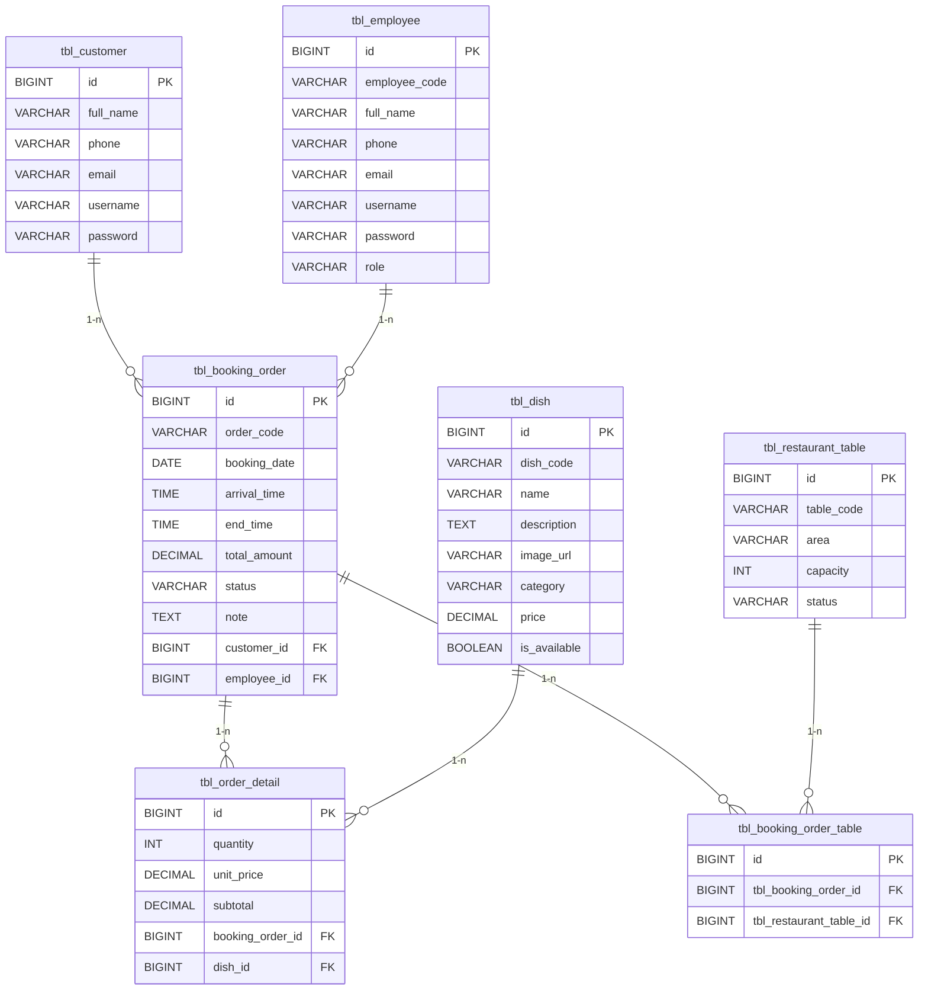

### 3.3. Danh sách các bảng của cơ sở dữ liệu 
Các trạng thái (status đơn đặt) được lưu dưới dạng cột VARCHAR trong bảng tương ứng, không tạo bảng riêng.
Trạng thái bận/rảnh của bàn theo khung giờ được suy ra từ các đơn đã xác nhận theo khoảng thời gian đặt.
Lớp DishStat là lớp DTO chỉ phục vụ hiển thị kết quả thống kê, không ánh xạ vào bảng trong cơ sở dữ liệu.
Hệ thống sử dụng 7 bảng lưu trữ chính như sau:
- **tbl_employee**: id (khóa chính), employee_code, full_name, phone, email, username, password, role
- **tbl_customer**: id (khóa chính), full_name, phone, email, username, password
- **tbl_restaurant_table**: id (khóa chính), table_code, area, capacity, status
- **tbl_dish**: id (khóa chính), dish_code, name, description, image_url, category, price, is_available
- **tbl_booking_order**: id (khóa chính), order_code, booking_date, arrival_time, end_time, total_amount, status, note, customer_id (khóa ngoại), employee_id (khóa ngoại)
- **tbl_order_detail**: id (khóa chính), quantity, unit_price, subtotal, booking_order_id (khóa ngoại), dish_id (khóa ngoại)
- **tbl_booking_order_table**: id (khóa chính), tbl_booking_order_id (khóa ngoại), tbl_restaurant_table_id (khóa ngoại)

### 3.4. Quan hệ giữa các bảng trong cơ sở dữ liệu

- **tbl_customer** – **tbl_booking_order**: Quan hệ 1 – n (Một khách hàng có thể có nhiều đơn đặt bàn).
- **tbl_employee** – **tbl_booking_order**: Quan hệ 1 – n (Một nhân viên có thể xác nhận/xử lý nhiều đơn đặt bàn).
- **tbl_booking_order** – **tbl_order_detail**: Quan hệ 1 – n (Một đơn đặt bàn có thể bao gồm nhiều dòng chi tiết món ăn).
- **tbl_dish** – **tbl_order_detail**: Quan hệ 1 – n (Một món ăn có thể xuất hiện trong nhiều dòng chi tiết của các đơn đặt khác nhau).
- **tbl_booking_order** – **tbl_booking_order_table**: Quan hệ 1 – n (Một đơn đặt bàn có thể gắn nhiều bàn).
- **tbl_restaurant_table** – **tbl_booking_order_table**: Quan hệ 1 – n (Một bàn có thể xuất hiện trong nhiều đơn đặt khác nhau theo các khung giờ khác nhau).

Suy ra quan hệ nghiệp vụ: **tbl_booking_order** – **tbl_restaurant_table** là quan hệ n – n thông qua bảng trung gian **tbl_booking_order_table**.

---

### Sơ đồ cơ sở dữ liệu (ER Diagram)

