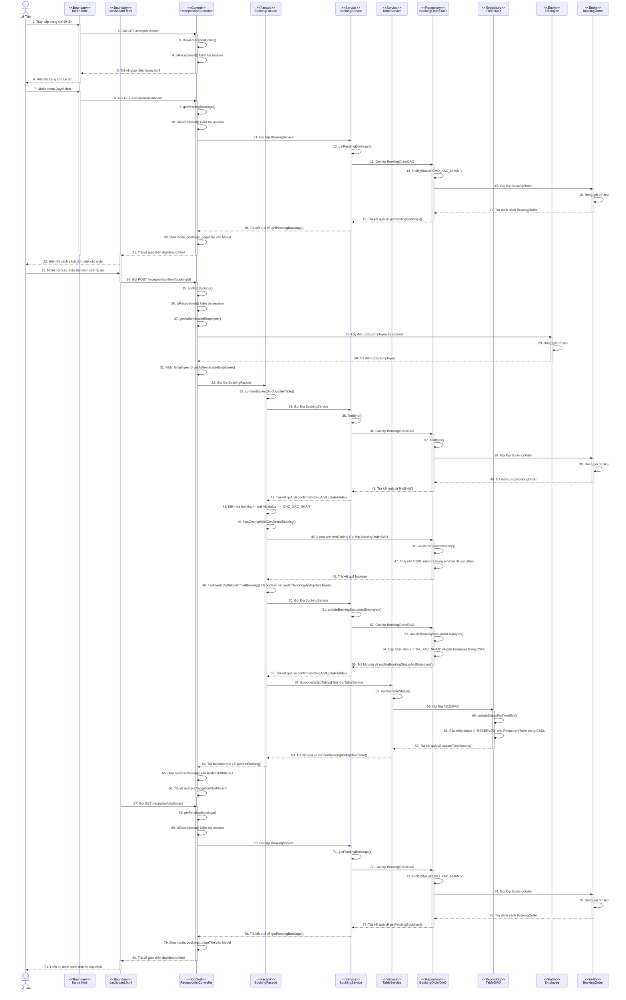

# Module Khách Đặt Bàn Và Chọn Món Online (Online Booking)

## 1. Thiết kế giao diện bên client/cho người dùng cuối
Giao diện module đặt bàn online được thiết kế tách rõ theo vai trò Khách hàng và Lễ tân. Luồng giao diện hiện tại cho phép khách chọn nhiều bàn, chọn món theo từng bàn, nhưng hệ thống chỉ tạo một đơn tổng duy nhất cho mỗi lần gửi yêu cầu.

### 1.1. Màn hình Trang chủ Khách hàng (Booking Home)
- **Chức năng Đặt bàn:** Điều hướng đến màn hình chọn ngày giờ đặt.
- **Chức năng Đơn đặt:** Mở danh sách đơn đã tạo của khách trong phiên đang đăng nhập.

### 1.2. Màn hình Chọn ngày giờ đặt (Time Selection)
- **Form chọn ngày/giờ:** Người dùng nhập ngày và giờ dùng bữa.
- **Kiểm tra hợp lệ thời gian:** Hệ thống validate giờ đặt theo quy tắc nghiệp vụ (từ thời điểm hiện tại trở đi, trong khung 08:00 - 23:00).

### 1.3. Màn hình Chọn bàn và chọn món theo từng bàn (Table & Dish Selection)
- **Danh sách bàn tổng hợp:** Hiển thị toàn bộ bàn trong hệ thống.
- **Trạng thái khả dụng:** Bàn đã kín lịch ở khung giờ đã chọn sẽ bị disable.
- **Chọn nhiều bàn:** Khách có thể tick nhiều `tableIds` trong cùng một lần đặt.
- **Chọn món riêng cho từng bàn:** Mỗi bàn có group món riêng theo key `dishIdsByTable_<tableId>`.
- **Tổng tiền dự kiến:** Được tính realtime trên client theo tổng món đã check.
- **Kết quả gửi:** Gửi về backend một request đặt bàn và tạo **1 đơn tổng duy nhất**.

### 1.4. Màn hình Đơn đặt của Khách (Orders & Order Detail)
- **Danh sách đơn (`/booking/orders`):**
  - Không có form nhập số điện thoại tìm kiếm.
  - Tự động lấy `CUSTOMER_PHONE` trong session.
  - Hiện tất cả đơn của khách theo số điện thoại session.
- **Chi tiết đơn (`/booking/order/{bookingId}`):**
  - Chỉ cho phép truy cập đơn thuộc đúng số điện thoại session.
  - Hiện danh sách nhiều bàn trong cùng đơn (nếu có).

### 1.5. Màn hình Lễ tân (Reception Home & Dashboard)
- **Trang chủ Lễ tân (`/reception/home`):** Cung cấp lối vào duyệt đơn.
- **Dashboard chờ duyệt (`/reception/dashboard`):** Hiện đơn chờ xác nhận (`CHO_XAC_NHAN`).
- **Danh sách tổng (`/reception/orders`):** Hiện toàn bộ đơn gửi đến.
- **Thao tác nghiệp vụ:** Xác nhận hoặc từ chối đơn, và đồng bộ trạng thái bàn.

---

## 2. Thiết kế biểu đồ lớp chi tiết và Phân tích Pattern

Module này áp dụng kiến trúc **MVC** kết hợp với **Facade Pattern** và **DAO Pattern**. Việc áp dụng Facade Pattern giúp tạo ra một điểm giao tiếp, thao tác tập trung để quản lý logic nghiệp vụ đặt bàn, trong khi DAO Pattern đảm bảo sự truy xuất dữ liệu an toàn và linh hoạt.

### 2.1. Chi tiết các thuộc tính và phương thức của cấu trúc Lớp (Implementation-level)

**Các lớp Giao diện (Views)**
- ooking_time_selection_html: Màn hình khách hàng nhập ngày và giờ muốn dùng bữa.
- ooking_table_selection_html: Màn hình hiển thị danh sách các bàn trống hợp lệ và thực đơn món ăn.
- ooking_orders_html: Màn hình danh sách đơn đặt bàn của khách.
- ooking_order_detail_html: Chi tiết từng phiếu đặt bao gồm đầy đủ bàn và món ăn khách chọn.
- 
eception_dashboard_html: Bảng điều khiển nơi bộ phận Lễ tân có thể truy xuất các đơn đang đợi duyệt và tiến hành cập nhật.

**Lớp BookingOrderController**
- **Thuộc tính (Dependencies):** 
  o - bookingFacade: BookingFacade
  o - tableService: TableService
  o - bookingService: BookingService
  o - dishService: DishService
  o - timeValidator: TimeValidator
- **Phương thức:**
  o +showCustomerHome(session: HttpSession): String
  o +showTimeSelection(session: HttpSession): String
  o +findAvailableTables(date: String, time: String, session: HttpSession, model: Model): String
  o +submitBooking(bookingDate: String, bookingTime: String, tableIds: List<Long>, formData: MultiValueMap<String, String>, session: HttpSession, model: Model): String
  o +viewCustomerOrders(session: HttpSession, model: Model): String
  o +viewBookingDetail(bookingId: Long, session: HttpSession, model: Model): String
  o +viewBookingStatus(phone: String, session: HttpSession, model: Model): String

**Lớp ReceptionistController**
- **Thuộc tính (Dependencies):** 
  o - bookingFacade: BookingFacade
  o - bookingService: BookingService
- **Phương thức:**
  o +showReceptionHome(session: HttpSession): String
  o +getPendingBookings(session: HttpSession, model: Model): String
  o +getAllBookings(session: HttpSession, model: Model): String
  o +confirmBooking(bookingId: Long, mode: String, session: HttpSession, redirectAttributes: RedirectAttributes): String
  o +rejectBooking(bookingId: Long, mode: String, session: HttpSession, redirectAttributes: RedirectAttributes): String
  o +viewOrderDetail(bookingId: Long, mode: String, session: HttpSession, model: Model): String

**Lớp BookingFacade**
- **Thuộc tính (Dependencies):** 
  o - bookingOrderDAO: BookingOrderDAO
  o - orderDetailDAO: OrderDetailDAO
  o - customerDAO: CustomerDAO
  o - dishService: DishService
  o - bookingService: BookingService
  o - tableService: TableService
- **Phương thức:**
  o +createBookingForCustomer(customer: Customer, bookingDate: LocalDate, arrivalTime: LocalTime, selectedTables: List<RestaurantTable>, formData: MultiValueMap<String, String>): BookingOrder
  o +processNewBooking(bookingOrder: BookingOrder): void
  o +confirmBookingAndUpdateTable(bookingId: Long, employeeId: Long): boolean
  o +rejectBooking(bookingId: Long, employeeId: Long): void

**Lớp BookingService**
- **Thuộc tính (Dependencies):** 
  o - bookingOrderDAO: BookingOrderDAO
- **Phương thức:**
  o +createPendingBooking(bookingOrder: BookingOrder): BookingOrder
  o +updateBookingStatus(bookingId: Long, status: String): void
  o +updateBookingStatusAndEmployee(bookingId: Long, status: String, employeeId: Long): void
  o +findById(bookingId: Long): Optional<BookingOrder>
  o +getPendingBookings(): List<BookingOrder>
  o +getAllBookings(): List<BookingOrder>
  o +findLatestByPhone(phone: String): Optional<BookingOrder>
  o +findByPhone(phone: String): List<BookingOrder>
  o +findByCustomerId(customerId: Long): List<BookingOrder>

**Lớp TableService (Interface)**
- **Phương thức:**
  o +findAllTables(): List<RestaurantTable>
  o +findByAreaAndStatus(area: String, status: String): List<RestaurantTable>
  o +findById(id: Long): Optional<RestaurantTable>
  o +deleteTable(id: Long): void
  o +updateStatus(id: Long, status: String): void
  o +updateTableStatus(tableId: Long, status: String): void
  o +saveTable(table: RestaurantTable): RestaurantTable
  o +isTableCodeUnique(tableCode: String, expectedId: Long): boolean
  o +getAvailableTables(date: String, time: String): List<RestaurantTable>

**Lớp DishService (Interface)**
- **Phương thức:**
  o +findDishes(keyword: String, category: String): List<Dish>
  o +getDishDTOById(id: Long): DishDTO
  o +getDishById(id: Long): Dish
  o +saveDish(dishDTO: DishDTO): Dish
  o +deleteDish(id: Long): void
  o +updateDishStatus(id: Long, isAvailable: boolean): void
  o +isDishCodeUnique(dishCode: String, expectedId: Long): boolean

**Lớp BookingOrderDAO**
- **Phương thức:**
  o +insert(bookingOrder: BookingOrder): void
  o +update(bookingOrder: BookingOrder): void
  o +findById(id: Long): Optional<BookingOrder>
  o +findByCustomerId(customerId: Long): List<BookingOrder>
  o +findByStatus(status: String): List<BookingOrder>
  o +findAll(): List<BookingOrder>
  o +updateBookingStatus(bookingId: Long, status: String): void
  o +updateBookingStatusAndEmployee(bookingId: Long, status: String, employeeId: Long): void
  o +existsConfirmedOverlap(tableId: Long, date: LocalDate, start: LocalTime, end: LocalTime, excludeId: Long): boolean
  o +findByCustomerPhone(phone: String): List<BookingOrder>
  o +findLatestByCustomerPhone(phone: String): Optional<BookingOrder>

**Lớp OrderDetailDAO**
- **Phương thức:**
  o +insert(orderDetail: OrderDetail): void
  o +insertAll(orderDetails: List<OrderDetail>): void
  o +findByBookingOrderId(bookingOrderId: Long): List<OrderDetail>
  o +deleteByBookingOrderId(bookingOrderId: Long): void

**Lớp CustomerDAO**
- **Phương thức:**
  o +findById(id: Long): Optional<Customer>
  o +findByPhone(phone: String): Optional<Customer>
  o +findAll(): List<Customer>
  o +insert(customer: Customer): void
  o +update(customer: Customer): void
  o +delete(id: Long): void

**Lớp TableDAO**
- **Phương thức:**
  o +findById(id: Long): Optional<RestaurantTable>
  o +findAll(): List<RestaurantTable>
  o +findByAreaAndStatus(area: String, status: String): List<RestaurantTable>
  o +insert(table: RestaurantTable): void
  o +update(table: RestaurantTable): void
  o +delete(id: Long): void
  o +updateStatus(id: Long, status: String): void
  o +isTableCodeExists(tableCode: String, excludeId: Long): boolean
  o +findByTime(date: LocalDate, time: String): List<RestaurantTable>

**Lớp TimeValidator**
- **Thuộc tính:**
  o - BOOKING_DURATION_HOURS: int
- **Phương thức:**
  o +isValidBookingTime(date: String, time: String): boolean
  o +isValidBookingTime(date: LocalDate, time: LocalTime): boolean

### 2.2. Biểu đồ lớp (Class Diagram)

`mermaid
classDiagram
    %% --- TẦNG GIAO DIỆN (VIEWS) ---
    class booking_time_selection_html {
        <<View>>
    }
    class booking_table_selection_html {
        <<View>>
    }
    class booking_orders_html {
        <<View>>
    }
    class booking_order_detail_html {
        <<View>>
    }
    class reception_dashboard_html {
        <<View>>
    }

    class BookingOrderController {
        <<Controller>>
        -bookingFacade : BookingFacade
        -tableService : TableService
        -bookingService : BookingService
        -dishService : DishService
        -timeValidator : TimeValidator
        +showCustomerHome(session: HttpSession): String
        +showTimeSelection(session: HttpSession): String
        +findAvailableTables(date: String, time: String, session: HttpSession, model: Model): String
        +submitBooking(bookingDate: String, bookingTime: String, tableIds: List~Long~, formData: MultiValueMap~String, String~, session: HttpSession, model: Model): String
        +viewCustomerOrders(session: HttpSession, model: Model): String
        +viewBookingDetail(bookingId: Long, session: HttpSession, model: Model): String
        +viewBookingStatus(phone: String, session: HttpSession, model: Model): String
    }

    class ReceptionistController {
        <<Controller>>
        -bookingFacade : BookingFacade
        -bookingService : BookingService
        +showReceptionHome(session: HttpSession): String
        +getPendingBookings(session: HttpSession, model: Model): String
        +getAllBookings(session: HttpSession, model: Model): String
        +confirmBooking(bookingId: Long, mode: String, session: HttpSession, redirectAttributes: RedirectAttributes): String
        +rejectBooking(bookingId: Long, mode: String, session: HttpSession, redirectAttributes: RedirectAttributes): String
        +viewOrderDetail(bookingId: Long, mode: String, session: HttpSession, model: Model): String
    }

    class BookingFacade {
        <<Facade>>
        -bookingOrderDAO : BookingOrderDAO
        -orderDetailDAO : OrderDetailDAO
        -customerDAO : CustomerDAO
        -dishService : DishService
        -bookingService : BookingService
        -tableService : TableService
        +createBookingForCustomer(customer: Customer, bookingDate: LocalDate, arrivalTime: LocalTime, selectedTables: List~RestaurantTable~, formData: MultiValueMap~String, String~): BookingOrder
        +processNewBooking(bookingOrder: BookingOrder): void
        +confirmBookingAndUpdateTable(bookingId: Long, employeeId: Long): boolean
        +rejectBooking(bookingId: Long, employeeId: Long): void
    }

    class BookingService {
        <<Service>>
        -bookingOrderDAO : BookingOrderDAO
        +createPendingBooking(bookingOrder: BookingOrder): BookingOrder
        +updateBookingStatus(bookingId: Long, status: String): void
        +updateBookingStatusAndEmployee(bookingId: Long, status: String, employeeId: Long): void
        +findById(bookingId: Long): Optional~BookingOrder~
        +getPendingBookings(): List~BookingOrder~
        +getAllBookings(): List~BookingOrder~
        +findLatestByPhone(phone: String): Optional~BookingOrder~
        +findByPhone(phone: String): List~BookingOrder~
        +findByCustomerId(customerId: Long): List~BookingOrder~
    }

    class TableService {
        <<Interface>>
        +findAllTables(): List~RestaurantTable~
        +findByAreaAndStatus(area: String, status: String): List~RestaurantTable~
        +findById(id: Long): Optional~RestaurantTable~
        +deleteTable(id: Long): void
        +updateStatus(id: Long, status: String): void
        +updateTableStatus(tableId: Long, status: String): void
        +saveTable(table: RestaurantTable): RestaurantTable
        +isTableCodeUnique(tableCode: String, expectedId: Long): boolean
        +getAvailableTables(date: String, time: String): List~RestaurantTable~
    }

    class DishService {
        <<Interface>>
        +findDishes(keyword: String, category: String): List~Dish~
        +getDishDTOById(id: Long): DishDTO
        +getDishById(id: Long): Dish
        +saveDish(dishDTO: DishDTO): Dish
        +deleteDish(id: Long): void
        +updateDishStatus(id: Long, isAvailable: boolean): void
        +isDishCodeUnique(dishCode: String, expectedId: Long): boolean
    }

    class BookingOrderDAO {
        <<Repository>>
        +insert(bookingOrder: BookingOrder): void
        +update(bookingOrder: BookingOrder): void
        +findById(id: Long): Optional~BookingOrder~
        +findByCustomerId(customerId: Long): List~BookingOrder~
        +findByStatus(status: String): List~BookingOrder~
        +findAll(): List~BookingOrder~
        +updateBookingStatus(bookingId: Long, status: String): void
        +updateBookingStatusAndEmployee(bookingId: Long, status: String, employeeId: Long): void
        +existsConfirmedOverlap(tableId: Long, date: LocalDate, start: LocalTime, end: LocalTime, excludeId: Long): boolean
        +findByCustomerPhone(phone: String): List~BookingOrder~
        +findLatestByCustomerPhone(phone: String): Optional~BookingOrder~
    }
    
    class OrderDetailDAO {
        <<Repository>>
        +insert(orderDetail: OrderDetail): void
        +insertAll(orderDetails: List~OrderDetail~): void
        +findByBookingOrderId(bookingOrderId: Long): List~OrderDetail~
        +deleteByBookingOrderId(bookingOrderId: Long): void
    }

    class CustomerDAO {
        <<Repository>>
        +findById(id: Long): Optional~Customer~
        +findByPhone(phone: String): Optional~Customer~
        +findAll(): List~Customer~
        +insert(customer: Customer): void
        +update(customer: Customer): void
        +delete(id: Long): void
    }

    class TableDAO {
        <<Repository>>
        +findById(id: Long): Optional~RestaurantTable~
        +findAll(): List~RestaurantTable~
        +findByAreaAndStatus(area: String, status: String): List~RestaurantTable~
        +insert(table: RestaurantTable): void
        +update(table: RestaurantTable): void
        +delete(id: Long): void
        +updateStatus(id: Long, status: String): void
        +isTableCodeExists(tableCode: String, excludeId: Long): boolean
        +findByTime(date: LocalDate, time: String): List~RestaurantTable~
    }

    class TimeValidator {
        <<Utility>>
        -BOOKING_DURATION_HOURS: int = 2
        +isValidBookingTime(date: String, time: String): boolean
        +isValidBookingTime(date: LocalDate, time: LocalTime): boolean
    }

    %% Relationships
    BookingOrderController --> booking_time_selection_html : chuyển trang UI
    BookingOrderController --> booking_table_selection_html : chuyển trang UI
    BookingOrderController --> booking_orders_html : chuyển trang UI
    BookingOrderController --> booking_order_detail_html : chuyển trang UI
    ReceptionistController --> reception_dashboard_html : chuyển trang UI
    ReceptionistController --> booking_order_detail_html : chuyển trang UI

    BookingOrderController --> BookingFacade 
    BookingOrderController --> TimeValidator 
    ReceptionistController --> BookingFacade 
    
    BookingFacade --> BookingService 
    BookingFacade --> TableService 
    BookingFacade --> DishService 
    BookingFacade --> BookingOrderDAO 
    BookingFacade --> OrderDetailDAO 
    BookingFacade --> CustomerDAO 
    
    BookingService --> BookingOrderDAO 
    TableService --> TableDAO 
`

### 2.3. Phân tích ưu điểm các Pattern được áp dụng

Trong module Khách đặt bàn và chọn món online, nghiệp vụ phát sinh sự phức tạp rất cao do phải thao tác đồng thời trên nhiều thực thể (Đặt chỗ, Bàn trống, Món ăn, Thông tin Khách, Chi tiết Đơn đặt). Việc áp dụng các Design Pattern mang lại những lợi ích cụ thể:

**1. Facade Pattern (Quy tụ tại BookingFacade)**
- **Giữ cho Controller gọn nhẹ (Thin Controller):** BookingOrderController không cần phải gọi lắt nhắt từng service (check lịch đặt, lưu phiếu đặt bàn chung, bóc tách ormData để tính tiền từng món ăn, lưu chi tiết món...). Thay vào đó, nó chỉ gọi một hàm duy nhất BookingFacade.createBookingForCustomer(), giúp luồng Controller dễ đọc và dễ bảo trì.
- **Quản lý Giao dịch an toàn (Transaction Management):** Thao tác Lưu đơn đặt chung qua BookingOrderDAO và Lưu lượng lớn chi tiết món ăn qua OrderDetailDAO được thực hiện bên trong cùng một hàm của Facade có gắn @Transactional. Nếu hệ thống xảy ra lỗi (VD: không lưu được món thứ 3), toàn bộ thao tác đặt bàn sẽ được *Rollback*, tránh tình trạng rác dữ liệu rò rỉ (VD: Có đơn bàn nhưng không có đồ ăn).
- **Giảm tính phụ thuộc phức tạp (Loose Coupling):** Lớp Controller không bị quá tải bởi việc Autowire 5-6 DAO hay Service cùng lúc. Facade đứng ra làm nhạc trưởng che giấu đi sự phức tạp của các service cấp con.

**2. DAO / Repository Pattern**
- **Đóng gói logic truy vấn CSDL phức tạp:** Hàm kiểm tra bàn trống hoặc trùng lịch existsConfirmedOverlap() yêu cầu truy vấn khoảng thời gian tương đối phức tạp, logic này được cô lập tại DAO. Tầng trên (Service, Facade) chỉ việc gọi hàm lấy kết quả (boolean), đảm bảo che giấu hoàn toàn logic SQL với tầng nghiệp vụ.
- **Tính Tái sử dụng cao:** Cơ chế truy vấn liên quan đến bàn (Tìm bàn rảnh rỗi từ giờ X đến giờ Y) tại TableDAO.findByTime có thể được tái sử dụng tùy ý.

**3. Kiến trúc MVC Pattern**
- **Phân tách trách nhiệm (Separation of Concerns):** Dữ liệu giao diện (View - HTML) tách biệt hoàn toàn khỏi logic xử lý nghiệp vụ, giao tiếp với nhau duy nhất thông qua Input Request và output Model. Cho phép khách hàng chọn được cùng lúc nhiều bàn rảnh rỗi và đặt món riêng cho từng bàn ngay trên giao diện (client-side render UI) một cách linh hoạt không ảnh hưởng Backend.

---

### 2.3. Phân tích ưu điểm các Pattern được áp dụng

Trong module Khách đặt bàn và chọn món online, nghiệp vụ phát sinh sự phức tạp rất cao do phải thao tác đồng thời trên nhiều thực thể (Bàn trống, Đặt chỗ, Món ăn, Thông tin Khách, Chi tiết Đơn đặt). Việc áp dụng các Pattern mang lại những lợi ích cụ thể:

**1. Facade Pattern (Quy tụ tại BookingFacade)**
- **Giữ cho Controller gọn nhẹ (Thin Controller):** BookingOrderController không cần đi vòng vèo gọi lắt nhắt từng service (check lịch đặt, lưu phiếu, bóc tách formData tính tiền từng món, lưu chi tiết món...). Thay vào đó nó gọi duy nhất hàm BookingFacade.createBookingForCustomer(), giúp Controllers dễ đọc, dễ bảo trì.
- **Quản lý Giao dịch an toàn (Transaction Management):** Thao tác lưu Order tổng (BookingOrderDAO) và lưu lượng dư liệu lớn chi tiết món (OrderDetailDAO) được thực hiện bên trong cùng một hàm của Facade chứa annotation @Transactional. Nếu xảy ra lỗi giữa chừng (VD: không lưu được món thứ 3), toàn bộ database sẽ được *Rollback*, loại bỏ hoàn toàn tình trạng rò rỉ dữ liệu (Có bàn đặt nhưng lại mất danh sách độ ăn).
- **Giảm tính phụ thuộc chéo (Loose Coupling):** Các Lớp Controller không bị trói buộc phức tạp bởi việc phải kết nối 6-7 DAO và Service. Lớp Facade đúng nghĩa là nhạc trưởng điều phối toàn bộ các cấp con.

**2. DAO / Repository Pattern**
- **Đóng gói logic truy vấn CSDL phức tạp:** Các nghiệp vụ check khoảng thời gian trống theo thuật toán chồng lấp existsConfirmedOverlap(...) đòi hỏi các câu lệnh SQL kiểm tra tương đối phức tạp. Các logic này được giấu gọn đi dưới tầng Data Access. Tầng trên chỉ cần nhận lại kết quả logic True/False.
- **Tính Tái sử dụng cao:** Logic truy vấn như tìm tất cả bàn có thể sử dụng được theo Giờ/Ngày (TableDAO.findByTime) là logic độc lập và có thể được tái sử dụng đồng thời ở cả quy trình Lễ Tân duyệt đơn hay màn hình Lễ Tân kiểm tra trực tiếp.

**3. Kiến trúc MVC Pattern**
- **Phân tách trách nhiệm (Separation of Concerns):** Mã giao diện (Màn hình chọn bàn của Khách/Dashboard của Lễ tân) tách biệt khỏi luồng xử lý Backend mạnh mẽ thông qua Input/Output Model. Nhờ thế khách có thể dễ dàng đánh checkbox thêm/bớt nhiều bàn, chọn từng món ăn cục bộ trên client thay vì backend phải xử lý liên tục từng cái thao tác click chuột của khách hàng.

### 2.3. Phân tích ưu điểm các Pattern được áp dụng

Trong module Khách đặt bàn và chọn món online, nghiệp vụ phát sinh sự phức tạp rất cao do phải thao tác đồng thời trên nhiều thực thể (Bàn trống, Đặt chỗ, Món ăn, Thông tin Khách, Chi tiết Đơn đặt). Việc áp dụng các Pattern mang lại những lợi ích cụ thể:

**1. Facade Pattern (Quy tụ tại BookingFacade)**
- **Giữ cho Controller gọn nhẹ (Thin Controller):** BookingOrderController không cần gọi lắt nhắt từng service (check lịch đặt, lưu phiếu, bóc tách formData tính tiền từng món, lưu chi tiết món...). Thay vào đó nó gọi một hàm duy nhất BookingFacade.createBookingForCustomer().
- **Quản lý Giao dịch an toàn (Transaction Management):** Thao tác lưu phiếu đơn tổng (BookingOrderDAO) và lưu tập hợp lớn dữ liệu chi tiết món từng bàn (OrderDetailDAO) được đưa vào chung một luồng xử lý @Transactional. Nếu gặp lỗi giữa chừng, thao tác sẽ được *Rollback* hoàn toàn thay vì rò rỉ dữ liệu gây sai sót kinh doanh.
- **Giảm tính phụ thuộc chéo (Loose Coupling):** Các Controller không bị trói buộc và quá tải bởi việc tiêm toàn bộ 6-7 lớp Service/DAO cùng lúc. Tầng trên chỉ giao lưu với Facade, còn những kết nối chồng chéo phức tạp nhất diễn ra ngầm bên trong Facade.

**2. DAO / Repository Pattern**
- **Đóng gói logic SQL phức tạp:** Các phép tính chồng lấp thời gian để giữ chỗ (existsConfirmedOverlap) yêu cầu độ logic truy vấn Query cao. Việc đóng gói tại DAO đảm bảo lớp Service hoàn toàn không bận tâm đến ngôn ngữ truy vấn là gì, mà chỉ nhận lại kiểu logic trả về True/False.
- **Tính Tái sử dụng linh hoạt:** Logic truy vấn tình trạng bàn trống theo khoảng Giờ/Ngày (TableDAO.findByTime) có thể được lôi ra sử dụng đồng thời ở màn hình Khách hàng hoặc Dashboard check bàn rảnh trực tiếp của Lễ Tân.

**3. Kiến trúc MVC Pattern**
- **Phân tách trách nhiệm (Separation of Concerns):** Luồng dữ liệu (HTML/Thymeleaf vs Backend Service) tách bạch bằng Output Request param/Model. Giao diện Client thoải mái đảm nhận thao tác check/bỏ check chọn nhiều bàn một cách cục bộ, thêm bớt món ăn cục bộ. Tránh được việc backend phải bắt tín hiệu và xử lý mỗi khi khách nhấn một cú click chuột tính tiền.

---

## 3. Các Biểu đồ Tuần tự (Sequence Diagrams)

### 3.1. Biểu đồ: Khách đặt bàn và chọn món online

Phản ánh toàn bộ luồng giao dịch khách hàng đặt bàn và chọn món ăn online, từ lúc truy cập trang chủ, chọn ngày giờ, tìm bàn trống, chọn bàn chọn món, gửi đơn đặt và xem danh sách đơn. Luồng đi qua các tầng Controller → Facade → Service → DAO → Entity theo kiến trúc MVC kết hợp Facade + DAO Pattern.

**Kịch bản khách hàng đặt bàn và chọn món online:**

1, Khách hàng truy cập trang chủ booking trên home.html
2, home.html gọi lớp BookingOrderController
3, Lớp BookingOrderController gọi phương thức showCustomerHome()
4, Phương thức showCustomerHome() kiểm tra session khách hàng qua isCustomer()
5, Phương thức showCustomerHome() trả về giao diện home.html
6, Giao diện home.html hiển thị cho Khách hàng
7, Khách hàng nhấn nút Đặt bàn trên home.html
8, home.html gọi lớp BookingOrderController
9, Lớp BookingOrderController gọi phương thức showTimeSelection()
10, Phương thức showTimeSelection() kiểm tra session khách hàng qua isCustomer()
11, Phương thức showTimeSelection() trả về giao diện time-selection.html
12, Giao diện time-selection.html hiển thị cho Khách hàng
13, Khách hàng nhập ngày và giờ dùng bữa, sau đó nhấn nút Tìm bàn trống trên time-selection.html
14, time-selection.html gọi lớp BookingOrderController qua POST /find-tables
15, Lớp BookingOrderController gọi phương thức findAvailableTables()
16, Phương thức findAvailableTables() gọi lớp TimeValidator
17, Lớp TimeValidator gọi phương thức isValidBookingTime()
18, Phương thức isValidBookingTime() kiểm tra thời gian đặt từ thời điểm hiện tại trở đi và trong khung giờ 08:00 đến 21:00
19, Phương thức isValidBookingTime() trả kết quả boolean về cho phương thức findAvailableTables()
20, Phương thức findAvailableTables() gọi phương thức nội bộ renderTableAndDishSelection()
21, Phương thức renderTableAndDishSelection() gọi lớp TableService
22, Lớp TableService gọi phương thức findAllTables()
23, Phương thức findAllTables() gọi lớp TableDAO
24, Lớp TableDAO gọi phương thức findAll()
25, Phương thức findAll() gọi lớp RestaurantTable
26, Lớp RestaurantTable đóng gói dữ liệu
27, Lớp RestaurantTable trả danh sách RestaurantTable về cho phương thức findAll()
28, Phương thức findAll() trả kết quả về cho phương thức findAllTables()
29, Phương thức findAllTables() trả kết quả về cho phương thức renderTableAndDishSelection()
30, Phương thức renderTableAndDishSelection() gọi lớp TableService
31, Lớp TableService gọi phương thức getAvailableTables()
32, Phương thức getAvailableTables() gọi lớp TableDAO
33, Lớp TableDAO gọi phương thức findByTime()
34, Phương thức findByTime() truy vấn CSDL lọc các bàn không trùng lịch đã xác nhận
35, Phương thức findByTime() gọi lớp RestaurantTable
36, Lớp RestaurantTable đóng gói dữ liệu
37, Lớp RestaurantTable trả danh sách RestaurantTable khả dụng về cho phương thức findByTime()
38, Phương thức findByTime() trả kết quả về cho phương thức getAvailableTables()
39, Phương thức getAvailableTables() trả kết quả về cho phương thức renderTableAndDishSelection()
40, Phương thức renderTableAndDishSelection() gọi lớp DishService
41, Lớp DishService gọi phương thức findDishes()
42, Phương thức findDishes() gọi lớp DishDAO
43, Lớp DishDAO gọi phương thức findByKeywordAndCategory()
44, Phương thức findByKeywordAndCategory() gọi lớp Dish
45, Lớp Dish đóng gói dữ liệu
46, Lớp Dish trả danh sách Dish về cho phương thức findByKeywordAndCategory()
47, Phương thức findByKeywordAndCategory() trả kết quả về cho phương thức findDishes()
48, Phương thức findDishes() trả kết quả về cho phương thức renderTableAndDishSelection()
49, Phương thức renderTableAndDishSelection() lọc danh sách Dish chỉ giữ các món có isAvailable = true
50, Phương thức renderTableAndDishSelection() đưa allTables, availableTableIds, dishes vào Model
51, Phương thức renderTableAndDishSelection() trả về giao diện table-selection.html
52, Giao diện table-selection.html hiển thị danh sách bàn và thực đơn cho Khách hàng
53, Khách hàng tích chọn một hoặc nhiều bàn trống và chọn món ăn cho từng bàn trên table-selection.html
54, Khách hàng nhấn nút Hoàn thành Đặt Bàn trên table-selection.html
55, table-selection.html gọi lớp BookingOrderController qua POST /submit
56, Lớp BookingOrderController gọi phương thức submitBooking()
57, Phương thức submitBooking() kiểm tra session khách hàng qua isCustomer()
58, Phương thức submitBooking() gọi phương thức nội bộ getAuthenticatedCustomer()
59, Phương thức getAuthenticatedCustomer() lấy đối tượng Customer từ session
60, Lớp Customer đóng gói dữ liệu
61, Lớp Customer trả đối tượng Customer về cho phương thức getAuthenticatedCustomer()
62, Phương thức getAuthenticatedCustomer() trả đối tượng Customer về cho phương thức submitBooking()
63, Phương thức submitBooking() gọi lớp TimeValidator
64, Lớp TimeValidator gọi phương thức isValidBookingTime()
65, Phương thức isValidBookingTime() kiểm tra tính hợp lệ của ngày giờ đặt
66, Phương thức isValidBookingTime() trả kết quả boolean về cho phương thức submitBooking()
67, Phương thức submitBooking() gọi lớp TableService
68, Lớp TableService gọi phương thức getAvailableTables()
69, Phương thức getAvailableTables() gọi lớp TableDAO
70, Lớp TableDAO gọi phương thức findByTime()
71, Phương thức findByTime() gọi lớp RestaurantTable
72, Lớp RestaurantTable đóng gói dữ liệu
73, Lớp RestaurantTable trả danh sách RestaurantTable khả dụng về cho phương thức findByTime()
74, Phương thức findByTime() trả kết quả về cho phương thức getAvailableTables()
75, Phương thức getAvailableTables() trả kết quả về cho phương thức submitBooking()
76, Phương thức submitBooking() lọc danh sách tableIds gửi lên so với whitelist bàn khả dụng
77, Phương thức submitBooking() lặp qua từng tableId hợp lệ, gọi lớp TableService
78, Lớp TableService gọi phương thức findById()
79, Phương thức findById() gọi lớp TableDAO
80, Lớp TableDAO gọi phương thức findById()
81, Phương thức findById() gọi lớp RestaurantTable
82, Lớp RestaurantTable đóng gói dữ liệu
83, Lớp RestaurantTable trả đối tượng RestaurantTable về cho phương thức findById()
84, Phương thức findById() trả kết quả về cho phương thức findById() của TableService
85, Phương thức findById() trả kết quả về cho phương thức submitBooking()
86, Phương thức submitBooking() thu được danh sách selectedTables
87, Phương thức submitBooking() gọi lớp BookingFacade
88, Lớp BookingFacade gọi phương thức createBookingForCustomer()
89, Phương thức createBookingForCustomer() gọi lớp CustomerDAO
90, Lớp CustomerDAO gọi phương thức findById()
91, Phương thức findById() gọi lớp Customer
92, Lớp Customer đóng gói dữ liệu
93, Lớp Customer trả đối tượng Customer về cho phương thức findById()
94, Phương thức findById() trả kết quả về cho phương thức createBookingForCustomer()
95, Phương thức createBookingForCustomer() lặp qua danh sách bàn đã chọn, gọi lớp TableService
96, Lớp TableService gọi phương thức findById()
97, Phương thức findById() gọi lớp TableDAO
98, Lớp TableDAO gọi phương thức findById()
99, Phương thức findById() gọi lớp RestaurantTable
100, Lớp RestaurantTable đóng gói dữ liệu
101, Lớp RestaurantTable trả đối tượng RestaurantTable về cho phương thức findById()
102, Phương thức findById() trả kết quả về cho phương thức findById() của TableService
103, Phương thức findById() trả danh sách managed RestaurantTable về cho phương thức createBookingForCustomer()
104, Phương thức createBookingForCustomer() lặp qua formData theo từng bàn đã chọn, gọi lớp DishService
105, Lớp DishService gọi phương thức getDishById()
106, Phương thức getDishById() gọi lớp DishDAO
107, Lớp DishDAO gọi phương thức findById()
108, Phương thức findById() gọi lớp Dish
109, Lớp Dish đóng gói dữ liệu
110, Lớp Dish trả đối tượng Dish về cho phương thức findById()
111, Phương thức findById() trả kết quả về cho phương thức getDishById()
112, Phương thức getDishById() trả kết quả về cho phương thức createBookingForCustomer()
113, Phương thức createBookingForCustomer() kiểm tra isAvailable của Dish và tích lũy dishQuantities
114, Phương thức createBookingForCustomer() khởi tạo lớp BookingOrder
115, Lớp BookingOrder đóng gói dữ liệu (orderCode, bookingDate, arrivalTime, endTime, status = CHO_XAC_NHAN, customer, selectedTables)
116, Lớp BookingOrder trả đối tượng BookingOrder về cho phương thức createBookingForCustomer()
117, Phương thức createBookingForCustomer() gọi lớp BookingOrderDAO
118, Lớp BookingOrderDAO gọi phương thức insert()
119, Phương thức insert() lưu BookingOrder vào CSDL
120, Phương thức insert() trả kết quả về cho phương thức createBookingForCustomer()
121, Phương thức createBookingForCustomer() lặp qua dishQuantities, gọi lớp DishService
122, Lớp DishService gọi phương thức getDishById()
123, Phương thức getDishById() gọi lớp DishDAO
124, Lớp DishDAO gọi phương thức findById()
125, Phương thức findById() gọi lớp Dish
126, Lớp Dish đóng gói dữ liệu
127, Lớp Dish trả đối tượng Dish về cho phương thức findById()
128, Phương thức findById() trả kết quả về cho phương thức getDishById()
129, Phương thức getDishById() trả kết quả về cho phương thức createBookingForCustomer()
130, Phương thức createBookingForCustomer() khởi tạo lớp OrderDetail
131, Lớp OrderDetail đóng gói dữ liệu (bookingOrder, dish, quantity, unitPrice, subtotal)
132, Lớp OrderDetail trả đối tượng OrderDetail về cho phương thức createBookingForCustomer()
133, Phương thức createBookingForCustomer() cộng dồn subtotal vào totalAmount của BookingOrder
134, Phương thức createBookingForCustomer() cập nhật totalAmount và note cho BookingOrder
135, Phương thức createBookingForCustomer() gọi lớp BookingOrderDAO
136, Lớp BookingOrderDAO gọi phương thức update()
137, Phương thức update() cập nhật BookingOrder trong CSDL
138, Phương thức update() trả kết quả về cho phương thức createBookingForCustomer()
139, Phương thức createBookingForCustomer() gọi lớp OrderDetailDAO
140, Lớp OrderDetailDAO gọi phương thức insertAll()
141, Phương thức insertAll() lưu toàn bộ danh sách OrderDetail vào CSDL
142, Phương thức insertAll() trả kết quả về cho phương thức createBookingForCustomer()
143, Phương thức createBookingForCustomer() trả đối tượng BookingOrder hoàn chỉnh về cho phương thức submitBooking()
144, Phương thức submitBooking() lưu LAST_BOOKING_ID vào session
145, Phương thức submitBooking() trả về redirect đến đường dẫn /booking/orders
146, orders.html gọi lớp BookingOrderController
147, Lớp BookingOrderController gọi phương thức viewCustomerOrders()
148, Phương thức viewCustomerOrders() kiểm tra session khách hàng qua isCustomer()
149, Phương thức viewCustomerOrders() gọi phương thức nội bộ getAuthenticatedCustomer()
150, Phương thức getAuthenticatedCustomer() trả đối tượng Customer về cho phương thức viewCustomerOrders()
151, Phương thức viewCustomerOrders() gọi lớp BookingService
152, Lớp BookingService gọi phương thức findByCustomerId()
153, Phương thức findByCustomerId() gọi lớp BookingOrderDAO
154, Lớp BookingOrderDAO gọi phương thức findByCustomerId()
155, Phương thức findByCustomerId() gọi lớp BookingOrder
156, Lớp BookingOrder đóng gói dữ liệu
157, Lớp BookingOrder trả danh sách BookingOrder về cho phương thức findByCustomerId()
158, Phương thức findByCustomerId() trả kết quả về cho phương thức findByCustomerId() của BookingService
159, Phương thức findByCustomerId() trả kết quả về cho phương thức viewCustomerOrders()
160, Phương thức viewCustomerOrders() đưa customer và bookings vào Model
161, Phương thức viewCustomerOrders() trả về giao diện orders.html
162, Giao diện orders.html hiển thị danh sách đơn đặt bàn cho Khách hàng

```mermaid
sequenceDiagram
    actor KH as Khách Hàng
    participant Home as <<Boundary>><br/>home.html
    participant TimeSel as <<Boundary>><br/>time-selection.html
    participant TableSel as <<Boundary>><br/>table-selection.html
    participant Orders as <<Boundary>><br/>orders.html
    participant Ctrl as <<Control>><br/>BookingOrderController
    participant Val as <<Utility>><br/>TimeValidator
    participant Fac as <<Facade>><br/>BookingFacade
    participant TableSvc as <<Service>><br/>TableService
    participant DishSvc as <<Service>><br/>DishService
    participant BookSvc as <<Service>><br/>BookingService
    participant CustDAO as <<Repository>><br/>CustomerDAO
    participant TableDAO as <<Repository>><br/>TableDAO
    participant DishDAO as <<Repository>><br/>DishDAO
    participant BookDAO as <<Repository>><br/>BookingOrderDAO
    participant DtlDAO as <<Repository>><br/>OrderDetailDAO
    participant CustEnt as <<Entity>><br/>Customer
    participant TableEnt as <<Entity>><br/>RestaurantTable
    participant DishEnt as <<Entity>><br/>Dish
    participant BookEnt as <<Entity>><br/>BookingOrder
    participant DtlEnt as <<Entity>><br/>OrderDetail

    KH->>Home: 1. Truy cập trang chủ booking
    activate Home
    Home->>Ctrl: 2. Gọi GET /booking/home
    activate Ctrl
    Ctrl->>Ctrl: 3. showCustomerHome()
    Ctrl->>Ctrl: 4. isCustomer() kiểm tra session
    Ctrl-->>Home: 5. Trả về giao diện home.html
    deactivate Ctrl
    Home-->>KH: 6. Hiển thị trang chủ Khách hàng
    deactivate Home

    KH->>Home: 7. Nhấn nút Đặt bàn
    activate Home
    Home->>Ctrl: 8. Gọi GET /booking/time-selection
    activate Ctrl
    Ctrl->>Ctrl: 9. showTimeSelection()
    Ctrl->>Ctrl: 10. isCustomer() kiểm tra session
    Ctrl-->>TimeSel: 11. Trả về giao diện time-selection.html
    deactivate Ctrl
    deactivate Home
    activate TimeSel
    TimeSel-->>KH: 12. Hiển thị form chọn ngày giờ
    KH->>TimeSel: 13. Nhập ngày/giờ và nhấn Tìm bàn trống
    TimeSel->>Ctrl: 14. Gọi POST /booking/find-tables
    deactivate TimeSel
    activate Ctrl
    Ctrl->>Ctrl: 15. findAvailableTables()
    Ctrl->>Val: 16. Gọi lớp TimeValidator
    activate Val
    Val->>Val: 17. isValidBookingTime()
    Val->>Val: 18. Kiểm tra khung giờ 08:00-21:00
    Val-->>Ctrl: 19. Trả kết quả boolean
    deactivate Val
    Ctrl->>Ctrl: 20. renderTableAndDishSelection()
    Ctrl->>TableSvc: 21. Gọi lớp TableService
    activate TableSvc
    TableSvc->>TableSvc: 22. findAllTables()
    TableSvc->>TableDAO: 23. Gọi lớp TableDAO
    activate TableDAO
    TableDAO->>TableDAO: 24. findAll()
    TableDAO->>TableEnt: 25. Gọi lớp RestaurantTable
    activate TableEnt
    TableEnt->>TableEnt: 26. Đóng gói dữ liệu
    TableEnt-->>TableDAO: 27. Trả danh sách RestaurantTable
    deactivate TableEnt
    TableDAO-->>TableSvc: 28. Trả kết quả về findAllTables()
    deactivate TableDAO
    TableSvc-->>Ctrl: 29. Trả kết quả về renderTableAndDishSelection()
    deactivate TableSvc
    Ctrl->>TableSvc: 30. Gọi lớp TableService
    activate TableSvc
    TableSvc->>TableSvc: 31. getAvailableTables()
    TableSvc->>TableDAO: 32. Gọi lớp TableDAO
    activate TableDAO
    TableDAO->>TableDAO: 33. findByTime()
    TableDAO->>TableDAO: 34. Truy vấn CSDL lọc bàn không trùng lịch
    TableDAO->>TableEnt: 35. Gọi lớp RestaurantTable
    activate TableEnt
    TableEnt->>TableEnt: 36. Đóng gói dữ liệu
    TableEnt-->>TableDAO: 37. Trả danh sách RestaurantTable khả dụng
    deactivate TableEnt
    TableDAO-->>TableSvc: 38. Trả kết quả về getAvailableTables()
    deactivate TableDAO
    TableSvc-->>Ctrl: 39. Trả kết quả về renderTableAndDishSelection()
    deactivate TableSvc
    Ctrl->>DishSvc: 40. Gọi lớp DishService
    activate DishSvc
    DishSvc->>DishSvc: 41. findDishes()
    DishSvc->>DishDAO: 42. Gọi lớp DishDAO
    activate DishDAO
    DishDAO->>DishDAO: 43. findByKeywordAndCategory()
    DishDAO->>DishEnt: 44. Gọi lớp Dish
    activate DishEnt
    DishEnt->>DishEnt: 45. Đóng gói dữ liệu
    DishEnt-->>DishDAO: 46. Trả danh sách Dish
    deactivate DishEnt
    DishDAO-->>DishSvc: 47. Trả kết quả về findDishes()
    deactivate DishDAO
    DishSvc-->>Ctrl: 48. Trả kết quả về renderTableAndDishSelection()
    deactivate DishSvc
    Ctrl->>Ctrl: 49. Lọc Dish có isAvailable = true
    Ctrl->>Ctrl: 50. Đưa allTables, availableTableIds, dishes vào Model
    Ctrl-->>TableSel: 51. Trả về giao diện table-selection.html
    deactivate Ctrl
    activate TableSel
    TableSel-->>KH: 52. Hiển thị danh sách bàn và thực đơn

    KH->>TableSel: 53. Tích chọn bàn trống và chọn món ăn cho từng bàn
    KH->>TableSel: 54. Nhấn nút Hoàn thành Đặt Bàn
    TableSel->>Ctrl: 55. Gọi POST /booking/submit
    deactivate TableSel
    activate Ctrl
    Ctrl->>Ctrl: 56. submitBooking()
    Ctrl->>Ctrl: 57. isCustomer() kiểm tra session
    Ctrl->>Ctrl: 58. getAuthenticatedCustomer()
    Ctrl->>CustEnt: 59. Lấy đối tượng Customer từ session
    activate CustEnt
    CustEnt->>CustEnt: 60. Đóng gói dữ liệu
    CustEnt-->>Ctrl: 61. Trả đối tượng Customer
    deactivate CustEnt
    Ctrl->>Ctrl: 62. Nhận Customer từ getAuthenticatedCustomer()
    Ctrl->>Val: 63. Gọi lớp TimeValidator
    activate Val
    Val->>Val: 64. isValidBookingTime()
    Val->>Val: 65. Kiểm tra tính hợp lệ ngày giờ đặt
    Val-->>Ctrl: 66. Trả kết quả boolean
    deactivate Val
    Ctrl->>TableSvc: 67. Gọi lớp TableService
    activate TableSvc
    TableSvc->>TableSvc: 68. getAvailableTables()
    TableSvc->>TableDAO: 69. Gọi lớp TableDAO
    activate TableDAO
    TableDAO->>TableDAO: 70. findByTime()
    TableDAO->>TableEnt: 71. Gọi lớp RestaurantTable
    activate TableEnt
    TableEnt->>TableEnt: 72. Đóng gói dữ liệu
    TableEnt-->>TableDAO: 73. Trả danh sách RestaurantTable khả dụng
    deactivate TableEnt
    TableDAO-->>TableSvc: 74. Trả kết quả về getAvailableTables()
    deactivate TableDAO
    TableSvc-->>Ctrl: 75. Trả kết quả về submitBooking()
    deactivate TableSvc
    Ctrl->>Ctrl: 76. Lọc tableIds so với whitelist bàn khả dụng
    Ctrl->>TableSvc: 77. [Loop] Gọi lớp TableService cho từng tableId
    activate TableSvc
    TableSvc->>TableSvc: 78. findById()
    TableSvc->>TableDAO: 79. Gọi lớp TableDAO
    activate TableDAO
    TableDAO->>TableDAO: 80. findById()
    TableDAO->>TableEnt: 81. Gọi lớp RestaurantTable
    activate TableEnt
    TableEnt->>TableEnt: 82. Đóng gói dữ liệu
    TableEnt-->>TableDAO: 83. Trả đối tượng RestaurantTable
    deactivate TableEnt
    TableDAO-->>TableSvc: 84. Trả kết quả về findById()
    deactivate TableDAO
    TableSvc-->>Ctrl: 85. Trả kết quả về submitBooking()
    deactivate TableSvc
    Ctrl->>Ctrl: 86. Thu được danh sách selectedTables
    Ctrl->>Fac: 87. Gọi lớp BookingFacade
    activate Fac
    Fac->>Fac: 88. createBookingForCustomer()
    Fac->>CustDAO: 89. Gọi lớp CustomerDAO
    activate CustDAO
    CustDAO->>CustDAO: 90. findById()
    CustDAO->>CustEnt: 91. Gọi lớp Customer
    activate CustEnt
    CustEnt->>CustEnt: 92. Đóng gói dữ liệu
    CustEnt-->>CustDAO: 93. Trả đối tượng Customer
    deactivate CustEnt
    CustDAO-->>Fac: 94. Trả kết quả về createBookingForCustomer()
    deactivate CustDAO
    Fac->>TableSvc: 95. [Loop] Gọi lớp TableService cho từng bàn đã chọn
    activate TableSvc
    TableSvc->>TableSvc: 96. findById()
    TableSvc->>TableDAO: 97. Gọi lớp TableDAO
    activate TableDAO
    TableDAO->>TableDAO: 98. findById()
    TableDAO->>TableEnt: 99. Gọi lớp RestaurantTable
    activate TableEnt
    TableEnt->>TableEnt: 100. Đóng gói dữ liệu
    TableEnt-->>TableDAO: 101. Trả đối tượng RestaurantTable
    deactivate TableEnt
    TableDAO-->>TableSvc: 102. Trả kết quả về findById()
    deactivate TableDAO
    TableSvc-->>Fac: 103. Trả managed RestaurantTable về createBookingForCustomer()
    deactivate TableSvc
    Fac->>DishSvc: 104. [Loop formData] Gọi lớp DishService cho từng món
    activate DishSvc
    DishSvc->>DishSvc: 105. getDishById()
    DishSvc->>DishDAO: 106. Gọi lớp DishDAO
    activate DishDAO
    DishDAO->>DishDAO: 107. findById()
    DishDAO->>DishEnt: 108. Gọi lớp Dish
    activate DishEnt
    DishEnt->>DishEnt: 109. Đóng gói dữ liệu
    DishEnt-->>DishDAO: 110. Trả đối tượng Dish
    deactivate DishEnt
    DishDAO-->>DishSvc: 111. Trả kết quả về getDishById()
    deactivate DishDAO
    DishSvc-->>Fac: 112. Trả kết quả về createBookingForCustomer()
    deactivate DishSvc
    Fac->>Fac: 113. Kiểm tra isAvailable và tích lũy dishQuantities
    Fac->>BookEnt: 114. Khởi tạo lớp BookingOrder
    activate BookEnt
    BookEnt->>BookEnt: 115. Đóng gói dữ liệu (orderCode, bookingDate, arrivalTime, endTime, status, customer, selectedTables)
    BookEnt-->>Fac: 116. Trả đối tượng BookingOrder
    deactivate BookEnt
    Fac->>BookDAO: 117. Gọi lớp BookingOrderDAO
    activate BookDAO
    BookDAO->>BookDAO: 118. insert()
    BookDAO->>BookDAO: 119. Lưu BookingOrder vào CSDL
    BookDAO-->>Fac: 120. Trả kết quả về createBookingForCustomer()
    deactivate BookDAO
    Fac->>DishSvc: 121. [Loop dishQuantities] Gọi lớp DishService
    activate DishSvc
    DishSvc->>DishSvc: 122. getDishById()
    DishSvc->>DishDAO: 123. Gọi lớp DishDAO
    activate DishDAO
    DishDAO->>DishDAO: 124. findById()
    DishDAO->>DishEnt: 125. Gọi lớp Dish
    activate DishEnt
    DishEnt->>DishEnt: 126. Đóng gói dữ liệu
    DishEnt-->>DishDAO: 127. Trả đối tượng Dish
    deactivate DishEnt
    DishDAO-->>DishSvc: 128. Trả kết quả về getDishById()
    deactivate DishDAO
    DishSvc-->>Fac: 129. Trả kết quả về createBookingForCustomer()
    deactivate DishSvc
    Fac->>DtlEnt: 130. Khởi tạo lớp OrderDetail
    activate DtlEnt
    DtlEnt->>DtlEnt: 131. Đóng gói dữ liệu (bookingOrder, dish, quantity, unitPrice, subtotal)
    DtlEnt-->>Fac: 132. Trả đối tượng OrderDetail
    deactivate DtlEnt
    Fac->>Fac: 133. Cộng dồn subtotal vào totalAmount
    Fac->>Fac: 134. Cập nhật totalAmount và note cho BookingOrder
    Fac->>BookDAO: 135. Gọi lớp BookingOrderDAO
    activate BookDAO
    BookDAO->>BookDAO: 136. update()
    BookDAO->>BookDAO: 137. Cập nhật BookingOrder trong CSDL
    BookDAO-->>Fac: 138. Trả kết quả về createBookingForCustomer()
    deactivate BookDAO
    Fac->>DtlDAO: 139. Gọi lớp OrderDetailDAO
    activate DtlDAO
    DtlDAO->>DtlDAO: 140. insertAll()
    DtlDAO->>DtlDAO: 141. Lưu toàn bộ danh sách OrderDetail vào CSDL
    DtlDAO-->>Fac: 142. Trả kết quả về createBookingForCustomer()
    deactivate DtlDAO
    Fac-->>Ctrl: 143. Trả đối tượng BookingOrder hoàn chỉnh về submitBooking()
    deactivate Fac
    Ctrl->>Ctrl: 144. Lưu LAST_BOOKING_ID vào session
    Ctrl->>Ctrl: 145. Trả về redirect /booking/orders
    deactivate Ctrl

    Orders->>Ctrl: 146. Gọi GET /booking/orders
    activate Ctrl
    Ctrl->>Ctrl: 147. viewCustomerOrders()
    Ctrl->>Ctrl: 148. isCustomer() kiểm tra session
    Ctrl->>Ctrl: 149. getAuthenticatedCustomer()
    Ctrl->>CustEnt: 150. Lấy đối tượng Customer từ session
    activate CustEnt
    CustEnt-->>Ctrl: 150. Trả đối tượng Customer
    deactivate CustEnt
    Ctrl->>BookSvc: 151. Gọi lớp BookingService
    activate BookSvc
    BookSvc->>BookSvc: 152. findByCustomerId()
    BookSvc->>BookDAO: 153. Gọi lớp BookingOrderDAO
    activate BookDAO
    BookDAO->>BookDAO: 154. findByCustomerId()
    BookDAO->>BookEnt: 155. Gọi lớp BookingOrder
    activate BookEnt
    BookEnt->>BookEnt: 156. Đóng gói dữ liệu
    BookEnt-->>BookDAO: 157. Trả danh sách BookingOrder
    deactivate BookEnt
    BookDAO-->>BookSvc: 158. Trả kết quả về findByCustomerId()
    deactivate BookDAO
    BookSvc-->>Ctrl: 159. Trả kết quả về viewCustomerOrders()
    deactivate BookSvc
    Ctrl->>Ctrl: 160. Đưa customer và bookings vào Model
    Ctrl-->>Orders: 161. Trả về giao diện orders.html
    deactivate Ctrl
    activate Orders
    Orders-->>KH: 162. Hiển thị danh sách đơn đặt bàn
    deactivate Orders
```

---

### 3.2. Biểu đồ: Lễ tân cập nhật trạng thái đặt hàng (Duyệt đơn & Gán bàn)

Phản ánh toàn bộ luồng Lễ tân truy cập hệ thống, xem danh sách đơn chờ xác nhận, thực hiện xác nhận đơn (kiểm tra trùng lịch, cập nhật trạng thái đơn và bàn), và hệ thống làm mới giao diện sau khi duyệt. Luồng đi qua các tầng Controller → Facade → Service → DAO → Entity theo kiến trúc MVC kết hợp Facade + DAO Pattern.

**Kịch bản lễ tân cập nhật trạng thái đặt hàng:**

1, Lễ tân truy cập trang chủ lễ tân trên home.html
2, home.html gọi lớp ReceptionistController
3, Lớp ReceptionistController gọi phương thức showReceptionHome()
4, Phương thức showReceptionHome() kiểm tra session lễ tân qua isReceptionist()
5, Phương thức showReceptionHome() trả về giao diện home.html
6, Giao diện home.html hiển thị cho Lễ tân
7, Lễ tân nhấn menu Duyệt đơn trên home.html
8, home.html gọi lớp ReceptionistController
9, Lớp ReceptionistController gọi phương thức getPendingBookings()
10, Phương thức getPendingBookings() kiểm tra session lễ tân qua isReceptionist()
11, Phương thức getPendingBookings() gọi lớp BookingService
12, Lớp BookingService gọi phương thức getPendingBookings()
13, Phương thức getPendingBookings() gọi lớp BookingOrderDAO
14, Lớp BookingOrderDAO gọi phương thức findByStatus()
15, Phương thức findByStatus() gọi lớp BookingOrder
16, Lớp BookingOrder đóng gói dữ liệu
17, Lớp BookingOrder trả danh sách BookingOrder về cho phương thức findByStatus()
18, Phương thức findByStatus() trả kết quả về cho phương thức getPendingBookings() của BookingService
19, Phương thức getPendingBookings() trả kết quả về cho phương thức getPendingBookings() của ReceptionistController
20, Phương thức getPendingBookings() đưa mode, bookings, pageTitle vào Model
21, Phương thức getPendingBookings() trả về giao diện dashboard.html
22, Giao diện dashboard.html hiển thị danh sách đơn chờ xác nhận cho Lễ tân
23, Lễ tân nhấn nút Xác nhận trên đơn chờ duyệt trên dashboard.html
24, dashboard.html gọi lớp ReceptionistController qua POST /reception/confirm/{bookingId}
25, Lớp ReceptionistController gọi phương thức confirmBooking()
26, Phương thức confirmBooking() kiểm tra session lễ tân qua isReceptionist()
27, Phương thức confirmBooking() gọi phương thức nội bộ getAuthenticatedEmployee()
28, Phương thức getAuthenticatedEmployee() lấy đối tượng Employee từ session
29, Lớp Employee đóng gói dữ liệu
30, Lớp Employee trả đối tượng Employee về cho phương thức getAuthenticatedEmployee()
31, Phương thức getAuthenticatedEmployee() trả đối tượng Employee về cho phương thức confirmBooking()
32, Phương thức confirmBooking() gọi lớp BookingFacade
33, Lớp BookingFacade gọi phương thức confirmBookingAndUpdateTable()
34, Phương thức confirmBookingAndUpdateTable() gọi lớp BookingService
35, Lớp BookingService gọi phương thức findById()
36, Phương thức findById() gọi lớp BookingOrderDAO
37, Lớp BookingOrderDAO gọi phương thức findById()
38, Phương thức findById() gọi lớp BookingOrder
39, Lớp BookingOrder đóng gói dữ liệu
40, Lớp BookingOrder trả đối tượng BookingOrder về cho phương thức findById()
41, Phương thức findById() trả kết quả về cho phương thức findById() của BookingService
42, Phương thức findById() trả kết quả về cho phương thức confirmBookingAndUpdateTable()
43, Phương thức confirmBookingAndUpdateTable() kiểm tra booking != null và status == "CHO_XAC_NHAN"
44, Phương thức confirmBookingAndUpdateTable() gọi phương thức nội bộ hasOverlapWithConfirmedBooking()
45, Phương thức hasOverlapWithConfirmedBooking() lặp qua danh sách selectedTables trong BookingOrder, gọi lớp BookingOrderDAO
46, Lớp BookingOrderDAO gọi phương thức existsConfirmedOverlap()
47, Phương thức existsConfirmedOverlap() truy vấn CSDL kiểm tra trùng lịch bàn đã xác nhận
48, Phương thức existsConfirmedOverlap() trả kết quả boolean về cho phương thức hasOverlapWithConfirmedBooking()
49, Phương thức hasOverlapWithConfirmedBooking() trả kết quả boolean về cho phương thức confirmBookingAndUpdateTable()
50, Phương thức confirmBookingAndUpdateTable() gọi lớp BookingService
51, Lớp BookingService gọi phương thức updateBookingStatusAndEmployee()
52, Phương thức updateBookingStatusAndEmployee() gọi lớp BookingOrderDAO
53, Lớp BookingOrderDAO gọi phương thức updateBookingStatusAndEmployee()
54, Phương thức updateBookingStatusAndEmployee() cập nhật status = "DA_XAC_NHAN" và gán Employee trong CSDL
55, Phương thức updateBookingStatusAndEmployee() trả kết quả về cho phương thức updateBookingStatusAndEmployee() của BookingService
56, Phương thức updateBookingStatusAndEmployee() trả kết quả về cho phương thức confirmBookingAndUpdateTable()
57, Phương thức confirmBookingAndUpdateTable() lặp qua danh sách selectedTables, gọi lớp TableService
58, Lớp TableService gọi phương thức updateTableStatus()
59, Phương thức updateTableStatus() gọi lớp TableDAO
60, Lớp TableDAO gọi phương thức updateStatusForTimeSlot()
61, Phương thức updateStatusForTimeSlot() cập nhật status = "RESERVED" cho RestaurantTable trong CSDL
62, Phương thức updateStatusForTimeSlot() trả kết quả về cho phương thức updateTableStatus()
63, Phương thức updateTableStatus() trả kết quả về cho phương thức confirmBookingAndUpdateTable()
64, Phương thức confirmBookingAndUpdateTable() trả boolean true về cho phương thức confirmBooking()
65, Phương thức confirmBooking() đưa successMessage vào RedirectAttributes
66, Phương thức confirmBooking() trả về redirect đến đường dẫn /reception/dashboard
67, dashboard.html gọi lớp ReceptionistController
68, Lớp ReceptionistController gọi phương thức getPendingBookings()
69, Phương thức getPendingBookings() kiểm tra session lễ tân qua isReceptionist()
70, Phương thức getPendingBookings() gọi lớp BookingService
71, Lớp BookingService gọi phương thức getPendingBookings()
72, Phương thức getPendingBookings() gọi lớp BookingOrderDAO
73, Lớp BookingOrderDAO gọi phương thức findByStatus()
74, Phương thức findByStatus() gọi lớp BookingOrder
75, Lớp BookingOrder đóng gói dữ liệu
76, Lớp BookingOrder trả danh sách BookingOrder về cho phương thức findByStatus()
77, Phương thức findByStatus() trả kết quả về cho phương thức getPendingBookings() của BookingService
78, Phương thức getPendingBookings() trả kết quả về cho phương thức getPendingBookings() của ReceptionistController
79, Phương thức getPendingBookings() đưa mode, bookings, pageTitle vào Model
80, Phương thức getPendingBookings() trả về giao diện dashboard.html
81, Giao diện dashboard.html hiển thị danh sách đơn đã cập nhật cho Lễ tân

