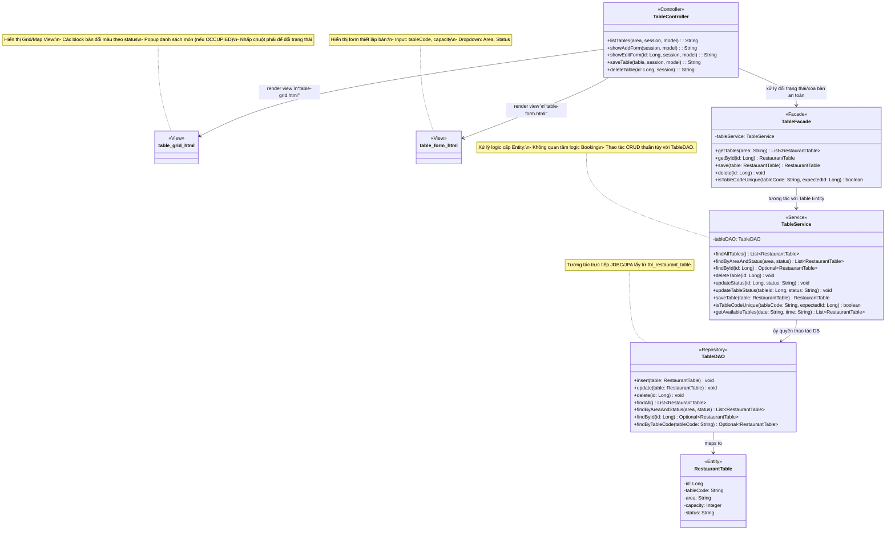
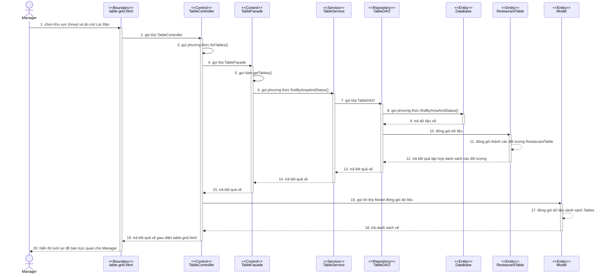
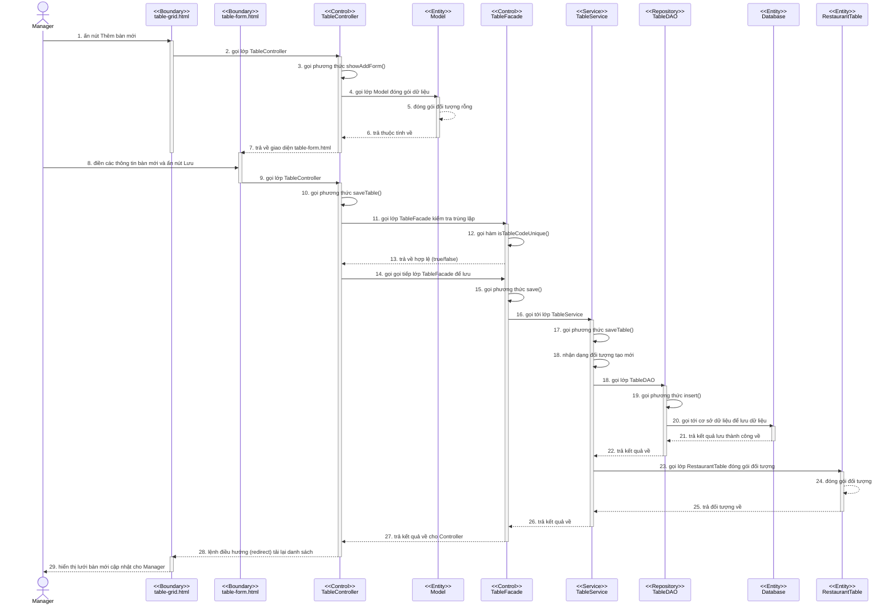
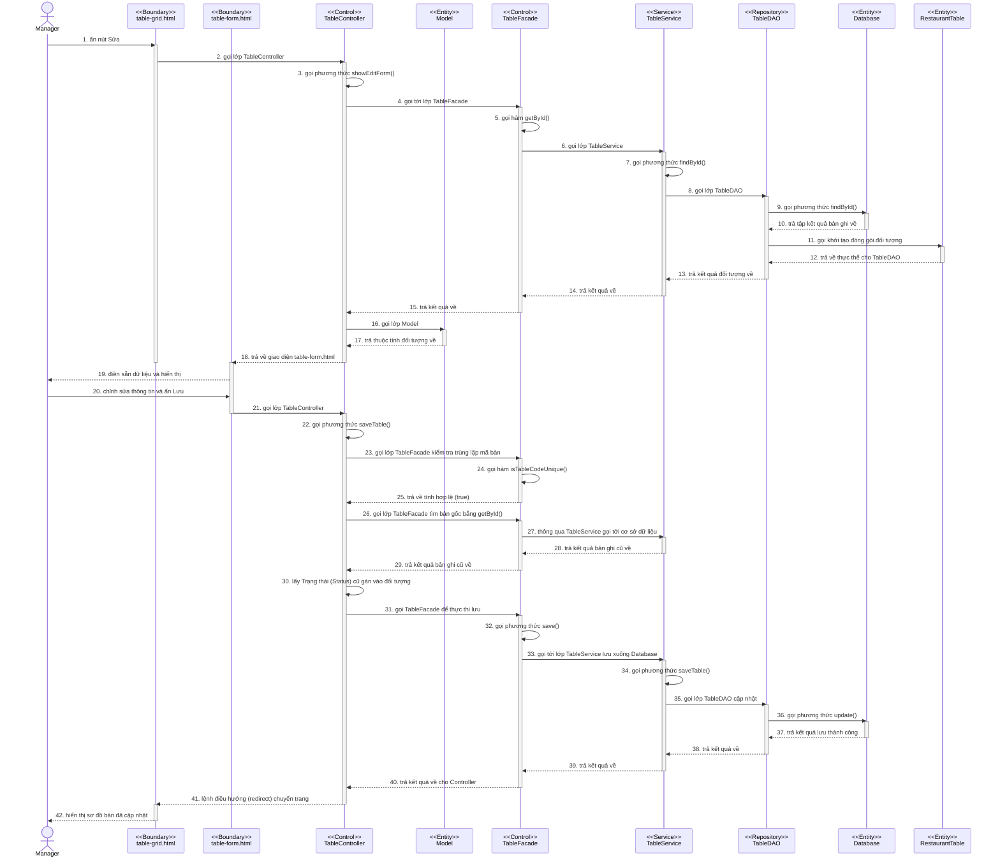
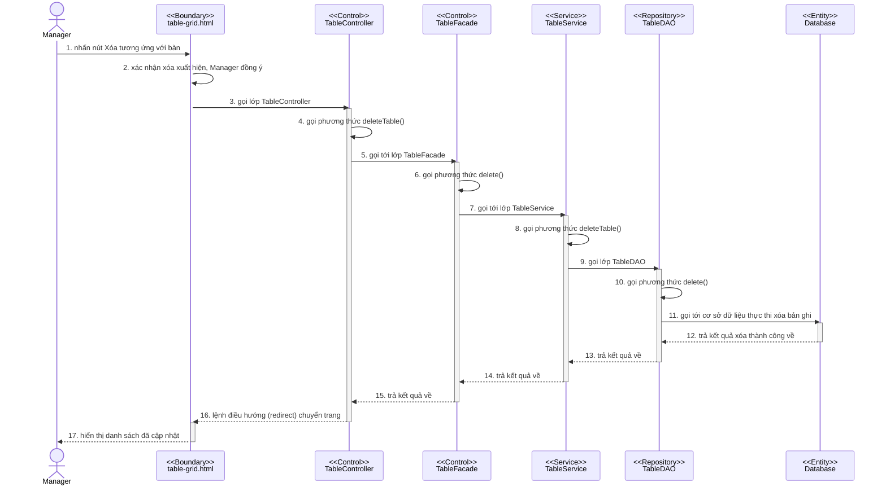

# Module Quản lý Bàn (Table Management)

## 1. Thiết kế giao diện bên client/cho người dùng cuối
Giao diện quản lý bàn dành cho tài khoản quản lý (Manager) và nhân viên phục vụ được thiết kế trực quan, giúp bao quát toàn bộ tình trạng phòng khách thực tế của nhà hàng. Bao gồm các màn hình chính sau:

### 1.1. Màn hình Sơ đồ Bàn (Table Grid/Map View)

### 1.2. Màn hình Thêm/Sửa Bàn (Table Form)
- **Thông tin cơ bản:** Form nhập liệu gồm Mã bàn (tableCode), Khu vực (area - dropdown), Sức chứa tối đa số ghế (capacity).

---

## 2. Thiết kế biểu đồ lớp chi tiết và Phân tích Pattern

Module quản lý bàn tiếp tục kế thừa kiến trúc **MVC** kết hợp với **Facade Pattern** và **DAO Pattern**. Việc quản lý bàn đòi hỏi kiểm soát tính toàn vẹn dữ liệu cực kỳ khắt khe (không được phép xóa hay bảo trì khi đang có khách).

### 2.1. Chi tiết các phương thức của cấu trúc Lớp (Implementation-level)

**Lớp TableController**
- Hàm hiển thị sơ đồ bàn theo khu vực -> `listTables(area: String, session: HttpSession, model: Model): String`
  o Tham số vào: area (String), session (HttpSession), model (Model)
  o Tham số ra: String (Tên file giao diện Thymeleaf dạng lưới)
- Hàm hiển thị Form sửa thông tin bàn -> `showEditForm(id: Long, session: HttpSession, model: Model): String`
  o Tham số vào: id (Long), session, model
  o Tham số ra: String (Hiển thị file form với object đã điền sẵn)
- Hàm hiển thị Form thêm thông tin bàn -> `showAddForm(session: HttpSession, model: Model): String`
  o Tham số vào: session, model
  o Tham số ra: String (Hiển thị file form với object rỗng)
- Hàm xóa một bàn khỏi hệ thống -> `deleteTable(id: Long, session: HttpSession): String`
  o Tham số vào: id (Long), session
  o Tham số ra: String (Lệnh redirect về sơ đồ bàn)
- Hàm lưu thông tin bàn mới/cập nhật từ form, có kiểm tra trùng lặp mã bàn -> `saveTable(table: RestaurantTable, session: HttpSession, model: Model): String`
  o Tham số vào: table (RestaurantTable), session, model
  o Tham số ra: String (Lệnh redirect hoặc tên file form kèm thông báo lỗi `errorMessage` nếu mã trùng)

**Lớp TableFacade**
- Hàm lấy danh sách bàn -> `getTables(area: String): List<RestaurantTable>`
  o Tham số vào: area (String)
  o Tham số ra: List<RestaurantTable>
- Hàm lấy thông tin bàn -> `getById(id: Long): RestaurantTable`
  o Tham số vào: id (Long)
  o Tham số ra: RestaurantTable
- Hàm lưu thông tin bàn -> `save(table: RestaurantTable): RestaurantTable`
  o Tham số vào: table (RestaurantTable)
  o Tham số ra: RestaurantTable
- Hàm xóa bàn -> `delete(id: Long): void`
  o Tham số vào: id (Long)
  o Tham số ra: void
- Hàm kiểm tra trùng mã bàn -> `isTableCodeUnique(tableCode: String, expectedId: Long): boolean`
  o Tham số vào: tableCode (String), expectedId (Long)
  o Tham số ra: boolean

**Lớp TableService**
- Hàm lấy toàn bộ danh sách bàn -> `findAllTables(): List<RestaurantTable>`
  o Tham số vào: không
  o Tham số ra: List<RestaurantTable>
- Hàm lọc bàn theo khu vực và trạng thái -> `findByAreaAndStatus(area: String, status: String): List<RestaurantTable>`
  o Tham số vào: area (String), status (String)
  o Tham số ra: List<RestaurantTable>
- Hàm tìm thông tin chi tiết một bàn -> `findById(id: Long): Optional<RestaurantTable>`
  o Tham số vào: id (Long)
  o Tham số ra: Optional<RestaurantTable>
- Hàm xóa thực thể bàn -> `deleteTable(id: Long): void`
  o Tham số vào: id (Long)
  o Tham số ra: void
- Hàm lưu thực thể bàn vào cơ sở dữ liệu -> `saveTable(table: RestaurantTable): RestaurantTable`
  o Tham số vào: table (RestaurantTable)
  o Tham số ra: RestaurantTable
- Hàm kiểm tra tính duy nhất của mã bàn -> `isTableCodeUnique(tableCode: String, expectedId: Long): boolean`
  o Tham số vào: tableCode (String), expectedId (Long)
  o Tham số ra: boolean
- Hàm cập nhật trạng thái bàn -> `updateStatus(id: Long, status: String): void`
  o Tham số vào: id (Long), status (String)
  o Tham số ra: void
- Hàm cập nhật trạng thái trực tiếp -> `updateTableStatus(tableId: Long, status: String): void`
  o Tham số vào: tableId (Long), status (String)
  o Tham số ra: void
- Hàm tìm các bàn còn trống theo ngày giờ -> `getAvailableTables(date: String, time: String): List<RestaurantTable>`
  o Tham số vào: date (String), time (String)
  o Tham số ra: List<RestaurantTable>

**Lớp TableDAO (Interface theo chuẩn Repository pattern)**
- Hàm thêm mới bản ghi vào bảng tbl_restaurant_table -> `insert(table: RestaurantTable): void`
  o Tham số vào: table (RestaurantTable)
  o Tham số ra: void
- Hàm cập nhật thông tin chỉnh sửa -> `update(table: RestaurantTable): void`
  o Tham số vào: table (RestaurantTable)
  o Tham số ra: void
- Hàm xóa bản ghi -> `delete(id: Long): void`
  o Tham số vào: id (Long)
  o Tham số ra: void
- Hàm tìm toàn bộ thực thể -> `findAll(): List<RestaurantTable>`
  o Tham số vào: không
  o Tham số ra: List<RestaurantTable>
- Hàm truy vấn bàn kết hợp tiêu chí -> `findByAreaAndStatus(area: String, status: String): List<RestaurantTable>`
  o Tham số vào: area (String), status (String)
  o Tham số ra: List<RestaurantTable>
- Hàm tìm một bản ghi theo khóa chính -> `findById(id: Long): Optional<RestaurantTable>`
  o Tham số vào: id (Long)
  o Tham số ra: Optional<RestaurantTable>
- Hàm tìm bản ghi dựa theo mã bàn (để kiểm tra trùng lặp) -> `findByTableCode(tableCode: String): Optional<RestaurantTable>`
  o Tham số vào: tableCode (String)
  o Tham số ra: Optional<RestaurantTable>

### 2.2. Biểu đồ lớp (Class Diagram)

### Phân tích ưu điểm Pattern đã sử dụng:
1. **Facade Pattern (Lớp `TableFacade`):** 
   - **Bối cảnh:** Việc thao tác liên quan tới Bàn yêu cầu kết hợp giữa việc kiểm tra trùng mã bàn, lưu và xóa. Cần một đầu mối chung để có thể tích hợp với các tính năng lớn hơn như Booking sau này.
   - **Ưu điểm:** Bằng cách tập trung giao tiếp vào `TableFacade`, tầng Controller được giải phóng khỏi việc gọi trực tiếp nhiều service khác nhau. `TableFacade` đóng vai trò "người gác cổng" để xử lý nghiệp vụ thông qua `TableService`.
2. **DAO / Repository Pattern (`TableDAO`):** 
   - Trừu tượng hóa thao tác tương tác với Database. Bất kỳ sự thay đổi nào đối với cơ sở dữ liệu đều chỉ cần tác động tại tầng của `TableDAO` mà không ảnh hưởng tới logic kiểm tra ràng buộc chéo trên tầng `TableService` hay `TableFacade`. Qua đó giúp đảm bảo tính linh hoạt và dễ nâng cấp cho code.

---

## 3. Các Biểu đồ Tuần tự (Sequence Diagrams)

Dưới đây là các biểu đồ tuần tự trọng tâm của module, mô phỏng chính xác luồng chạy của code MVC, luồng Validation và Facade Pattern kiểm soát tính vẹn toàn dữ liệu.

### 3.1. Biểu đồ: Lọc bàn theo điều kiện (Khu vực / Trạng thái)
**Các bước gọi luồng xử lý:**
1. Tại màn hình giao diện table-grid.html, Manager chọn khu vực (Area) và ấn nút Lọc Bàn
2. Giao diện table-grid.html gọi lớp TableController
3. Lớp TableController gọi phương thức listTables()
4. Phương thức listTables() gọi lớp TableFacade
5. Lớp TableFacade gọi hàm getTables()
6. Phương thức getTables() gọi phương thức findByAreaAndStatus() hoặc findAllTables() của lớp TableService
7. Lớp TableService gọi gọi lớp TableDAO
8. Lớp TableDAO gọi phương thức findByAreaAndStatus() hoặc findAll() tới cơ sở dữ liệu
9. Cơ sở dữ liệu trả dữ liệu về cho DAO
10. Phương thức của DAO gọi lớp RestaurantTable đóng gói dữ liệu
11. Lớp RestaurantTable lần lượt đóng gói thành các đối tượng RestaurantTable
12. Lớp RestaurantTable trả kết quả tập hợp danh sách các đối tượng RestaurantTable về DAO
13. Phương thức của TableDAO trả kết quả về cho phương thức của TableService
14. Phương thức của TableService trả kết quả về cho phương thức getTables() của Facade
15. Lớp TableFacade trả kết quả về cho phương thức listTables() của TableController
16. Phương thức listTables() gọi tới lớp Model đóng gói dữ liệu
17. Lớp Model đóng gói dữ liệu danh sách Tables
18. Lớp Model trả danh sách về cho phương thức listTables()
19. Phương thức listTables() trả kết quả về giao diện table-grid.html
20. Giao diện table-grid.html hiển thị lưới sơ đồ bàn trực quan cho Manager

### 3.2. Biểu đồ: Thêm bàn mới
**Các bước gọi luồng xử lý:**
1. Tại màn hình giao diện table-grid.html, Manager ấn nút Thêm bàn mới
2. Giao diện table-grid.html gọi lớp TableController
3. Lớp TableController gọi phương thức showAddForm()
4. Phương thức showAddForm() gọi lớp Model đóng gói dữ liệu
5. Lớp Model đóng gói đối tượng RestaurantTable rỗng
6. Lớp Model trả thuộc tính về cho phương thức showAddForm()
7. Phương thức showAddForm() trả về giao diện table-form.html
8. Tại màn hình giao diện table-form.html, Manager điền các thông tin bàn mới và ấn nút Lưu Thông Tin
9. Giao diện table-form.html gọi lớp TableController
10. Lớp TableController gọi phương thức saveTable()
11. Phương thức saveTable() gọi lớp TableFacade kiểm tra trùng lặp
12. Lớp TableFacade gọi hàm isTableCodeUnique()
13. Hàm isTableCodeUnique() trả về true/false hợp lệ
14. Phương thức saveTable() của Controller gọi tiếp lớp TableFacade để lưu
15. Lớp TableFacade gọi phương thức save()
16. Phương thức save() gọi tới lớp TableService
17. Lớp TableService gọi phương thức saveTable()
18. Phương thức saveTable() nhận dạng đối tượng tạo mới nên gọi lớp TableDAO
19. Lớp TableDAO gọi phương thức insert()
20. Phương thức insert() gọi tới cơ sở dữ liệu (Database) để lưu dữ liệu
21. Cơ sở dữ liệu trả kết quả lưu thành công về cho phương thức insert() của TableDAO
22. Phương thức insert() của TableDAO trả kết quả về cho phương thức saveTable() của TableService
23. Phương thức saveTable() gọi lớp RestaurantTable đóng gói đối tượng vừa lưu (kèm ID)
24. Lớp RestaurantTable đóng gói đối tượng
25. Lớp RestaurantTable trả đối tượng về cho phương thức saveTable() của TableService
26. Phương thức saveTable() của TableService trả kết quả về cho phương thức save() của TableFacade
27. Phương thức save() của TableFacade trả kết quả về cho Controller
28. Phương thức saveTable() của Controller lệnh điều hướng (redirect) tải lại danh sách
29. Giao diện table-grid.html hiển thị lưới bàn mới cập nhật cho Manager

### 3.3. Biểu đồ: Sửa thông tin bàn (Tích hợp Validation chống trùng Mã bàn)
**Các bước gọi luồng xử lý:**
1. Tại trang sơ đồ bàn table-grid.html, Manager ấn nút Sửa tương ứng với một bàn cụ thể
2. Giao diện table-grid.html gọi lớp TableController
3. Lớp TableController gọi phương thức showEditForm()
4. Phương thức showEditForm() gọi tới lớp TableFacade
5. Lớp TableFacade gọi hàm getById()
6. Hàm getById() gọi lớp TableService
7. Lớp TableService gọi phương thức findById()
8. Phương thức findById() gọi lớp TableDAO
9. Lớp TableDAO gọi phương thức findById() tới cơ sở dữ liệu
10. Cơ sở dữ liệu trả tập kết quả bản ghi về cho TableDAO
11. Lớp TableDAO gọi khởi tạo đóng gói đối tượng RestaurantTable
12. Đối tượng RestaurantTable trả về thực thể cho TableDAO
13. Lớp TableDAO trả kết quả đối tượng về cho TableService
14. Lớp TableService trả kết quả về cho TableFacade
15. Lớp TableFacade trả kết quả về cho TableController
16. Phương thức showEditForm() gọi lớp Model
17. Lớp Model đóng gói đối tượng vừa tìm thấy và trả thuộc tính về
18. Phương thức showEditForm() trả về giao diện table-form.html
19. Giao diện table-form.html được điền sẵn dữ liệu và hiển thị cho Manager
20. Manager chỉnh sửa các thông tin trên form và ấn nút Lưu Thông Tin
21. Giao diện table-form.html gọi lớp TableController
22. Lớp TableController gọi phương thức saveTable()
23. Phương thức saveTable() gọi lớp TableFacade kiểm tra trùng lặp mã bàn
24. Lớp TableFacade gọi hàm isTableCodeUnique()
25. Hàm isTableCodeUnique() trả về tính hợp lệ (true)
26. Phương thức saveTable() nhận diện thông tin mã bàn hợp lệ và bản ghi đã có ID (hành động sửa) nên gọi lớp TableFacade tìm bản gốc bằng getById()
27. Lớp TableFacade thông qua TableService gọi tới cơ sở dữ liệu
28. Dữ liệu bản ghi cũ trả về kết quả cho TableFacade
29. Lớp TableFacade trả kết quả bản ghi cũ về cho TableController
30. TableController lấy Trạng thái (Status) cũ gán vào đối tượng đang lưu để tránh mất dữ liệu
31. Phương thức saveTable() gọi lớp TableFacade để thực thi lưu
32. Lớp TableFacade gọi phương thức save()
33. Phương thức save() gọi tới lớp TableService lưu xuống Database
34. Lớp TableService gọi phương thức saveTable()
35. Phương thức saveTable() nhận dạng đối tượng đã tồn tại ID nên gọi lớp TableDAO cập nhật
36. Lớp TableDAO gọi phương thức update()
37. Cơ sở dữ liệu trả kết quả lưu thành công về cho TableDAO
38. Lớp TableDAO trả kết quả về cho TableService
39. Lớp TableService trả kết quả về cho TableFacade
40. Lớp TableFacade trả kết quả về cho TableController
41. Phương thức saveTable() lệnh điều hướng (redirect) chuyển trang về lại danh sách
42. Giao diện table-grid.html tải lại và hiển thị sơ đồ bàn đã cập nhật cho Manager

### 3.4. Biểu đồ: Xóa Bàn
**Các bước gọi luồng xử lý:**
1. Tại màn hình giao diện table-grid.html, Manager nhấn nút Xóa tương ứng với một bàn cụ thể
2. Giao diện xác nhận xóa xuất hiện, Manager chọn đồng ý (OK)
3. Giao diện table-grid.html gọi lớp TableController
4. Lớp TableController gọi phương thức deleteTable()
5. Phương thức deleteTable() gọi tới lớp TableFacade
6. Lớp TableFacade gọi phương thức delete()
7. Phương thức delete() gọi tới lớp TableService
8. Lớp TableService gọi phương thức deleteTable()
9. Phương thức deleteTable() gọi lớp TableDAO
10. Lớp TableDAO gọi phương thức delete()
11. Phương thức delete() gọi tới cơ sở dữ liệu để thực thi lệnh xóa bản ghi
12. Cơ sở dữ liệu trả kết quả xóa thành công về cho lệnh delete() của TableDAO
13. Phương thức delete() của TableDAO trả kết quả về cho phương thức deleteTable() của TableService
14. Phương thức deleteTable() của TableService trả kết quả về cho phương thức delete() của TableFacade
15. Phương thức delete() của TableFacade trả kết quả về cho phương thức deleteTable() của TableController
16. Phương thức deleteTable() lệnh điều hướng (redirect) chuyển trang về lại danh sách
17. Giao diện table-grid.html tải lại và hiển thị danh sách đã cập nhật cho Manager

