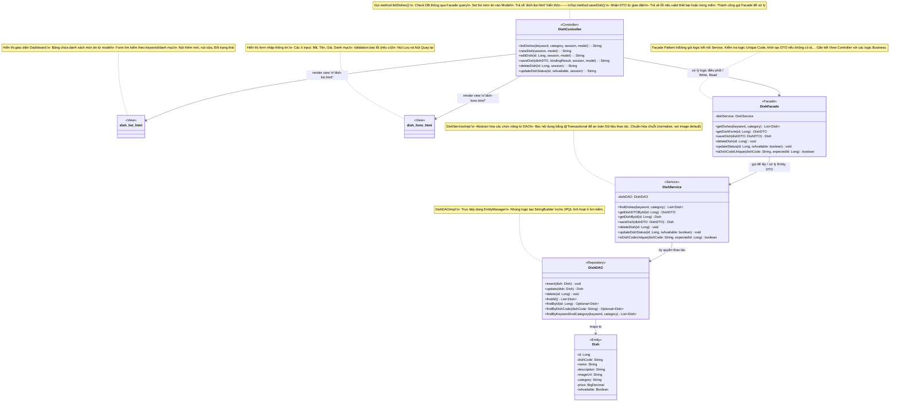
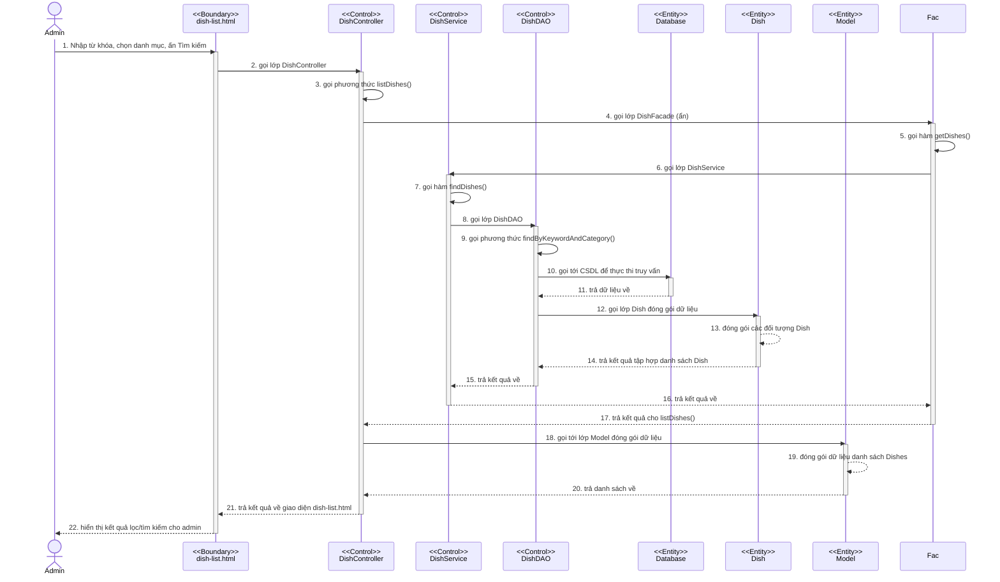
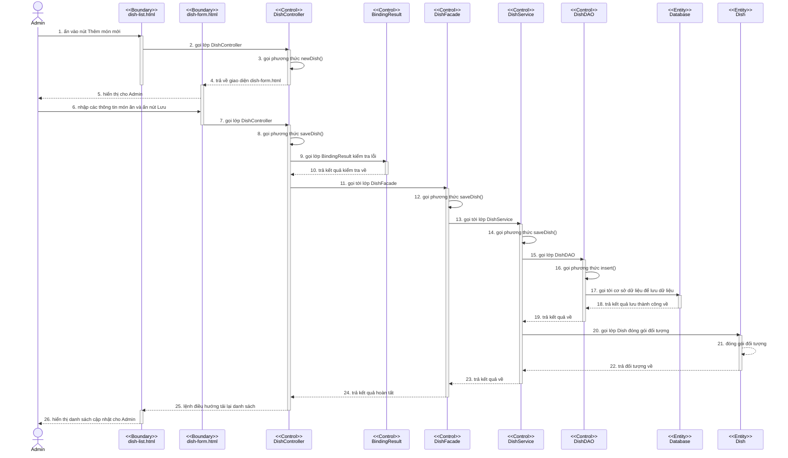
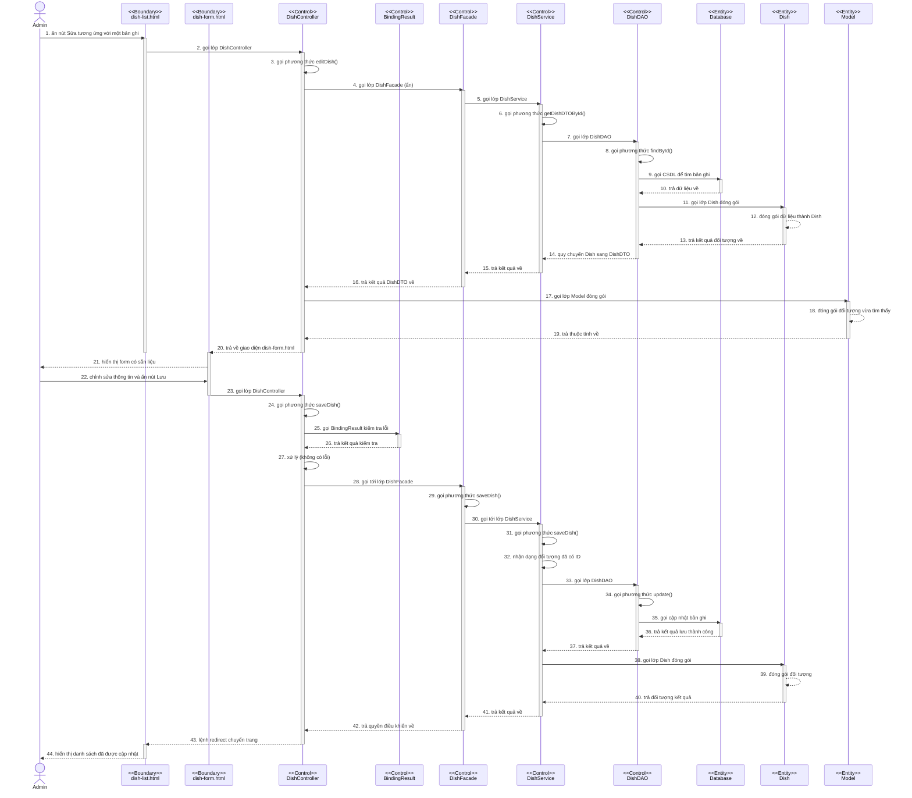
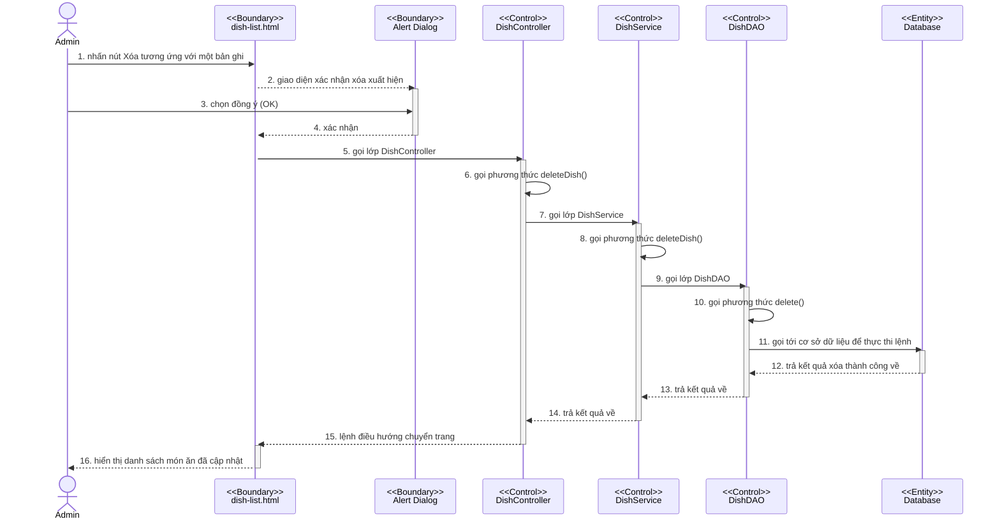
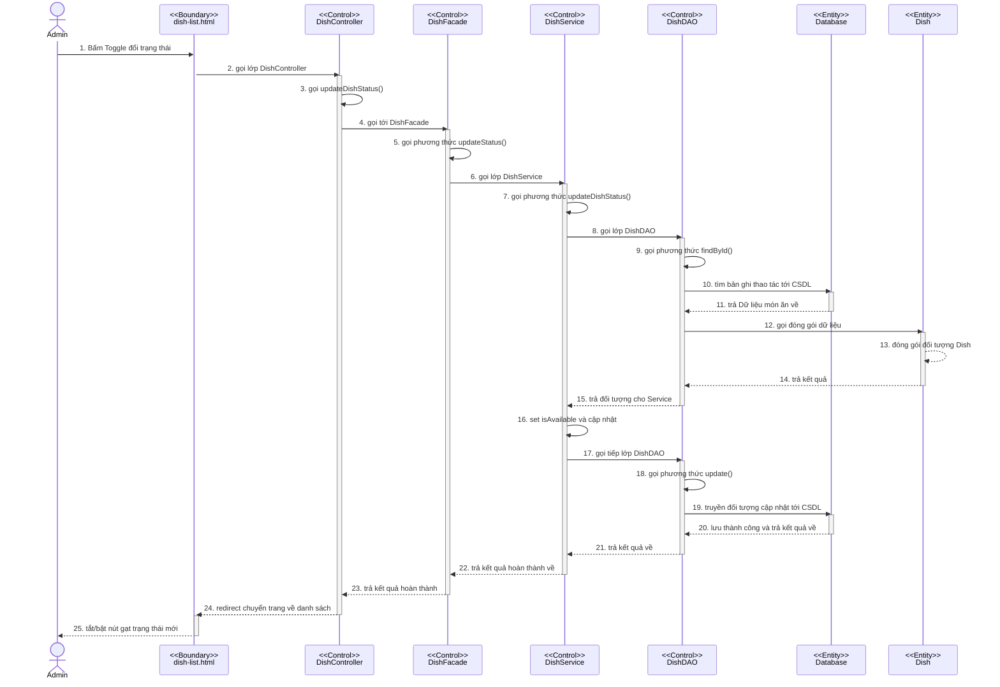

# Module Quản lý Món ăn (Dish Management)

## 1. Thiết kế giao diện bên client/cho người dùng cuối
Giao diện quản lý món ăn dành cho tài khoản quản lý (Manager) được thiết kế tập trung vào tính trực quan, dễ thao tác và quản trị thông tin nhanh chóng. Bao gồm các màn hình chính sau:

### 1.1. Màn hình Danh sách Thực đơn (Dish Dashboard)
- **Thanh công cụ tìm kiếm và lọc:** Cho phép tìm kiếm món ăn theo "Tên món", hoặc lọc theo "Danh mục" (Khai vị, Món chính, Đồ uống, Combo), lọc theo "Trạng thái" (Đang bán, Hết hàng).
- **Bảng dữ liệu món ăn (Data Table):** Hiển thị danh sách toàn bộ thực đơn với các cột: Ảnh thu nhỏ (Thumbnail), Tên món, Danh mục, Đơn giá, và Nút gạt (Toogle button) bật/tắt Trạng thái phục vụ.
- **Nút thao tác nhanh:** Nút tạo "Thêm món mới" nổi bật ở góc trên. Ở mỗi dòng dữ liệu sẽ có nút "Chỉnh sửa", "Thiết lập định lượng (Recipe)" và "Xóa".

### 1.2. Màn hình Thêm/Sửa Món ăn (Dish Form)
- **Thông tin cơ bản:** Form nhập liệu Tên món, Mô tả chi tiết, Danh mục (Dropdown), Đơn giá.
- **Tải ảnh (Image Upload):** Khu vực drag-n-drop để quản lý đăng tải hình ảnh minh họa cho món ăn.
- **Trạng thái:** Tùy chọn checkbox "Sẵn sàng phục vụ".

### 1.3. Màn hình Thiết lập Combo & Định lượng (Recipe Setup)
- **Tab Thiết lập Combo:** Giao diện cho phép chọn từ danh sách các món lẻ (checkbox), hiển thị tổng giá gốc và ô nhập giá ưu đãi của Combo đó.
- **Tab Thiết lập Định lượng nguyên liệu:** Cho phép Manager thêm các dòng nguyên liệu (tìm kiếm nguyên liệu từ kho) và nhập số lượng/đơn vị (vd: Thịt bò - 200 - gram). Đây là dữ liệu gốc dùng để trừ kho tự động.

---

## 2. Thiết kế biểu đồ lớp chi tiết và Phân tích Pattern

Module áp dụng kiến trúc **MVC** kết hợp với **Facade Pattern** và **DAO Pattern** để tách biệt trách nhiệm, quản lý sự phức tạp khi lưu món ăn kèm công thức và đồng bộ lên hệ thống khách hàng.

### 2.1. Chi tiết các phương thức của cấu trúc Lớp (Implementation-level)

**Lớp DishController**
- Hàm hiển thị danh sách món ăn, có kiểm tra quyền đăng nhập qua Session, hỗ trợ tìm kiếm -> `listDishes(keyword: String, category: String, session: HttpSession, model: Model): String`
  o Tham số vào: keyword (String), category (String), session (HttpSession), model (Model)
  o Tham số ra: String (Tên file giao diện Thymeleaf 'dish-list')
- Hàm hiển thị Form thêm món ăn mới -> `newDish(session: HttpSession, model: Model): String`
  o Tham số vào: session (HttpSession), model (Model)
  o Tham số ra: String (Hiển thị file 'dish-form' với đối tượng DishDTO trống)
- Hàm hiển thị Form sửa món ăn đã có dữ liệu -> `editDish(id: Long, session: HttpSession, model: Model): String`
  o Tham số vào: id (Long), session (HttpSession), model (Model)
  o Tham số ra: String (Hiển thị file form với object đã điền sẵn)
- Hàm lưu thông tin món ăn mới hoặc cập nhật từ form -> `saveDish(dishDTO: DishDTO, bindingResult: BindingResult, session: HttpSession, model: Model): String`
  o Tham số vào: dishDTO (DishDTO), bindingResult (BindingResult kiểm tra lỗi), session, model
  o Tham số ra: String (Lệnh redirect về danh sách hoặc tên file form nếu có lỗi)
- Hàm xóa món ăn khỏi hệ thống -> `deleteDish(id: Long, session: HttpSession): String`
  o Tham số vào: id (Long), session (HttpSession)
  o Tham số ra: String (Lệnh redirect về danh sách)
- Hàm cập nhật trạng thái món ăn (Sẵn sàng phục vụ / Hết hàng) -> `updateDishStatus(id: Long, isAvailable: boolean, session: HttpSession): String`
  o Tham số vào: id (Long), isAvailable (boolean), session (HttpSession)
  o Tham số ra: String (Lệnh redirect về danh sách)

**Lớp DishFacade**
- Hàm lấy danh sách món ăn -> `getDishes(keyword: String, category: String): List<Dish>`
  o Tham số vào: keyword (String), category (String)
  o Tham số ra: List<Dish>
- Hàm lấy dữ liệu món ăn đổ vào form -> `getDishForm(id: Long): DishDTO`
  o Tham số vào: id (Long)
  o Tham số ra: DishDTO
- Hàm lưu thông tin món ăn (điều phối sang Service) -> `saveDish(dishDTO: DishDTO): Dish`
  o Tham số vào: dishDTO (DishDTO)
  o Tham số ra: Dish
- Hàm điều phối xóa món ăn -> `deleteDish(id: Long): void`
  o Tham số vào: id (Long)
  o Tham số ra: void
- Hàm thay đổi trạng thái bán của món ăn -> `updateStatus(id: Long, isAvailable: boolean): void`
  o Tham số vào: id (Long), isAvailable (boolean)
  o Tham số ra: void
- Hàm kiểm tra trùng mã món -> `isDishCodeUnique(dishCode: String, expectedId: Long): boolean`
  o Tham số vào: dishCode (String), expectedId (Long)
  o Tham số ra: boolean

**Lớp DishService**
- Hàm tìm kiếm và lọc danh sách món ăn -> `findDishes(keyword: String, category: String): List<Dish>`
  o Tham số vào: keyword (String), category (String)
  o Tham số ra: List<Dish>
- Hàm lấy DTO của một món ăn -> `getDishDTOById(id: Long): DishDTO`
  o Tham số vào: id (Long)
  o Tham số ra: DishDTO
- Hàm tìm kiếm thông tin chi tiết một món ăn -> `getDishById(id: Long): Dish`
  o Tham số vào: id (Long)
  o Tham số ra: Dish
- Hàm lưu thông tin thực thể món ăn vào Database (bằng cách gọi DAO) -> `saveDish(dishDTO: DishDTO): Dish`
  o Tham số vào: dishDTO (DishDTO)
  o Tham số ra: Dish (trả về thực thể đã được lưu)
- Hàm xóa hệ thống thông tin một món ăn -> `deleteDish(id: Long): void`
  o Tham số vào: id (Long)
  o Tham số ra: void
- Hàm thực hiện cập nhật lại cột trạng thái (isAvailable) trong CSDL -> `updateDishStatus(id: Long, isAvailable: boolean): void`
  o Tham số vào: id (Long), isAvailable (boolean)
  o Tham số ra: void
- Hàm kiểm tra tính duy nhất của mã món -> `isDishCodeUnique(dishCode: String, expectedId: Long): boolean`
  o Tham số vào: dishCode (String), expectedId (Long)
  o Tham số ra: boolean

**Lớp DishDAO (Interface theo chuẩn Repository pattern)**
- Hàm thêm mới bản ghi vào bảng tbl_dish -> `insert(dish: Dish): void`
  o Tham số vào: dish (Dish)
  o Tham số ra: void
- Hàm cập nhật thông tin chỉnh sửa vào bảng tbl_dish -> `update(dish: Dish): Dish`
  o Tham số vào: dish (Dish)
  o Tham số ra: Dish
- Hàm xóa bản ghi thực thể món ăn khỏi bảng tbl_dish -> `delete(id: Long): void`
  o Tham số vào: id (Long)
  o Tham số ra: void
- Hàm tìm toàn bộ thực thể -> `findAll(): List<Dish>`
  o Tham số vào: không
  o Tham số ra: List<Dish>
- Hàm tìm một bản ghi theo khóa chính -> `findById(id: Long): Optional<Dish>`
  o Tham số vào: id (Long)
  o Tham số ra: Optional<Dish>
- Hàm tìm kiếm thực thể bằng mã món -> `findByDishCode(dishCode: String): Optional<Dish>`
  o Tham số vào: dishCode (String)
  o Tham số ra: Optional<Dish>
- Hàm tìm kiếm bằng keyword và danh mục -> `findByKeywordAndCategory(keyword: String, category: String): List<Dish>`
  o Tham số vào: keyword (String), category (String)
  o Tham số ra: List<Dish>

### 2.2. Biểu đồ lớp (Class Diagram)

### Phân tích ưu điểm Pattern đã sử dụng:
1. **Facade Pattern (Lớp `DishFacade`):** 
   - **Bối cảnh:** Khi thêm món ăn, hệ thống không chỉ kiểm tra validate, lưu bản ghi `Dish`, mà sau này còn phải định nghĩa thêm công việc như lưu danh sách nguyên liệu `Recipe`, xử lý liên kết `Combo`, và **giả lập đồng bộ** thông báo lên giao diện (đặt bàn online hoặc nhà bếp).
   - **Ưu điểm:** Controller không phải gọi 3-4 service khác nhau hay phải chờ đợi đồng bộ. Tất cả nghiệp vụ phối hợp được giấu sau `DishFacade`. Giảm sự phụ thuộc (Loose coupling) giữa controller (presentation layer) và các service ở dưới. Lập trình viên dễ bảo trì hơn nếu quy trình thêm thiết lập (như bắn email thông báo, thay đổi logic lưu combo) mà không ảnh hưởng tới Controller.
2. **DAO / Repository Pattern (`DishDAO`):** 
   - Trừu tượng hóa các thao tác tương tác với Database (sử dụng Hibernate/EntityManager). Tầng Service không cần tự viết hay bận tâm về câu lệnh SQL phức tạp mà chỉ cần gọi các hàm có sẵn như `insert()`, `update()`, `searchDishes()`. Điều này giúp hệ thống linh hoạt, dễ nâng cấp CSDL và dễ thực hiện viết Unit Test.

---

## 3. Thiết kế biểu đồ tuần tự hoạt động chi tiết

Dưới đây là 5 kịch bản biểu đồ tuần tự mô tả chi tiết toàn bộ luồng nghiệp vụ của module Quản lý món ăn. Phân tích được thực hiện chi tiết từng bước bóc tách logic code từ tầng View tới Repository, theo sát thiết kế hiển thị chuẩn như Visual Paradigm.

### 3.1. Xử lý Xem danh sách và Tìm kiếm món ăn
**Các bước gọi luồng xử lý:**
1. Nhập từ khóa, chọn danh mục, ấn Tìm kiếm
2. Giao diện dish-list.html gọi lớp DishController
3. Lớp DishController gọi phương thức listDishes()
4. Phương thức listDishes() gọi lớp DishFacade (ẩn)
5. Lớp DishFacade gọi hàm getDishes()
6. Phương thức getDishes() gọi lớp DishService
7. Lớp DishService gọi hàm findDishes()
8. Phương thức findDishes() gọi lớp DishDAO
9. Lớp DishDAO gọi phương thức findByKeywordAndCategory()
10. Phương thức findByKeywordAndCategory() gọi tới CSDL để thực thi truy vấn
11. CSDL trả dữ liệu về cho phương thức findByKeywordAndCategory() của DAO
12. Phương thức findByKeywordAndCategory() gọi lớp Dish đóng gói dữ liệu
13. Lớp Dish đóng gói các đối tượng Dish
14. Lớp Dish trả kết quả tập hợp danh sách Dish về cho DAO
15. Phương thức findByKeywordAndCategory() trả kết quả về cho Service
16. Phương thức findDishes() trả kết quả về cho Facade
17. Phương thức getDishes() trả kết quả cho listDishes() của Controller
18. Phương thức listDishes() gọi tới lớp Model đóng gói dữ liệu
19. Lớp Model đóng gói dữ liệu danh sách Dishes
20. Lớp Model trả danh sách về cho phương thức listDishes()
21. Phương thức listDishes() trả kết quả về giao diện dish-list.html
22. Giao diện dish-list.html hiển thị kết quả lọc/tìm kiếm cho admin

### 3.2. Xử lý Thêm món ăn mới (Sử dụng Facade Pattern)
**Các bước gọi luồng xử lý:**
1. Ấn vào nút Thêm món mới
2. Giao diện dish-list.html gọi lớp DishController
3. Lớp DishController gọi phương thức newDish()
4. Phương thức newDish() trả về giao diện dish-form.html
5. Giao diện dish-form.html hiển thị cho Admin
6. Nhập các thông tin món ăn và ấn nút Lưu
7. Giao diện dish-form.html gọi lớp DishController
8. Lớp DishController gọi phương thức saveDish()
9. Phương thức saveDish() gọi lớp BindingResult kiểm tra lỗi
10. Lớp BindingResult trả kết quả kiểm tra về cho phương thức saveDish()
11. Phương thức saveDish() gọi tới lớp DishFacade
12. Lớp DishFacade gọi phương thức saveDish()
13. Phương thức saveDish() của Facade gọi tới lớp DishService
14. Lớp DishService gọi phương thức saveDish()
15. Phương thức saveDish() của Service gọi lớp DishDAO
16. Lớp DishDAO gọi phương thức insert()
17. Phương thức insert() gọi tới cơ sở dữ liệu để lưu dữ liệu
18. Cơ sở dữ liệu trả kết quả lưu thành công về cho phương thức insert() của DAO
19. Phương thức insert() trả kết quả về cho Service
20. Phương thức saveDish() của Service gọi lớp Dish đóng gói đối tượng
21. Lớp Dish đóng gói đối tượng
22. Lớp Dish trả đối tượng về cho Service
23. Phương thức saveDish() của Service trả kết quả về cho Facade
24. Phương thức saveDish() của Facade trả kết quả hoàn tất cho Controller
25. Phương thức saveDish() của Controller lệnh điều hướng tải lại danh sách
26. Giao diện dish-list.html hiển thị danh sách cập nhật cho Admin

### 3.3. Xử lý Sửa thông tin món ăn
**Các bước gọi luồng xử lý:**
1. Ấn nút Sửa tương ứng với một bản ghi
2. Giao diện dish-list.html gọi lớp DishController
3. Lớp DishController gọi phương thức editDish()
4. Phương thức editDish() gọi lớp DishFacade (ẩn)
5. Lớp DishFacade gọi lớp DishService
6. Lớp DishService gọi phương thức getDishDTOById()
7. Phương thức getDishDTOById() gọi lớp DishDAO
8. Lớp DishDAO gọi phương thức findById()
9. Phương thức findById() gọi CSDL để tìm bản ghi
10. CSDL trả dữ liệu về cho DAO
11. Phương thức findById() gọi lớp Dish đóng gói
12. Lớp Dish đóng gói dữ liệu thành Dish
13. Lớp Dish trả kết quả đối tượng về cho DAO
14. DAO quy chuyển Dish sang DishDTO và trả về cho Service
15. Service trả kết quả về cho Facade
16. Facade trả kết quả DishDTO về cho Controller
17. Phương thức editDish() gọi lớp Model đóng gói
18. Lớp Model đóng gói đối tượng vừa tìm thấy
19. Lớp Model trả thuộc tính về cho Controller
20. Phương thức editDish() trả về giao diện dish-form.html
21. Giao diện dish-form.html hiển thị form có sẵn liệu
22. Admin chỉnh sửa thông tin và ấn nút Lưu
23. Giao diện dish-form.html gọi lớp DishController
24. Lớp DishController gọi phương thức saveDish()
25. Phương thức saveDish() gọi BindingResult kiểm tra lỗi
26. Lớp BindingResult trả kết quả kiểm tra về cho Controller
27. Controller xử lý (không có lỗi)
28. Phương thức saveDish() gọi tới lớp DishFacade
29. Lớp DishFacade gọi phương thức saveDish()
30. Phương thức saveDish() của Facade gọi tới lớp DishService
31. Lớp DishService gọi phương thức saveDish()
32. Phương thức saveDish() nhận dạng đối tượng đã có ID
33. Phương thức saveDish() gọi lớp DishDAO
34. Lớp DishDAO gọi phương thức update()
35. Phương thức update() gọi cập nhật bản ghi trong CSDL
36. CSDL trả kết quả lưu thành công về cho DAO
37. Phương thức update() trả kết quả về cho Service
38. Phương thức saveDish() gọi lớp Dish đóng gói
39. Lớp Dish đóng gói đối tượng
40. Lớp Dish trả đối tượng kết quả cho Service
41. Service trả kết quả về cho Facade
42. Facade trả quyền điều khiển về cho Controller
43. Controller lệnh redirect chuyển trang
44. Giao diện dish-list.html hiển thị danh sách đã được cập nhật

### 3.4. Xử lý Xóa món ăn
**Các bước gọi luồng xử lý:**
1. Nhấn nút Xóa tương ứng với một bản ghi
2. Giao diện xác nhận xóa xuất hiện
3. Chọn đồng ý (OK)
4. Xác nhận từ Alert trả về UI
5. Giao diện dish-list.html gọi lớp DishController
6. Lớp DishController gọi phương thức deleteDish()
7. Phương thức deleteDish() gọi lớp DishService
8. Lớp DishService gọi phương thức deleteDish()
9. Phương thức deleteDish() gọi lớp DishDAO
10. Lớp DishDAO gọi phương thức delete()
11. Phương thức delete() gọi tới cơ sở dữ liệu để thực thi lệnh
12. CSDL trả kết quả xóa thành công về cho DAO
13. DAO trả kết quả về cho Service
14. Service trả kết quả về cho Controller
15. Controller lệnh điều hướng chuyển trang
16. Giao diện dish-list.html hiển thị danh sách món ăn đã cập nhật

### 3.5. Xử lý Cập nhật Trạng thái (Bật/Tắt Hết Hàng Online)
**Các bước gọi luồng xử lý:**
1. Bấm Toggle đổi trạng thái
2. Giao diện dish-list.html gọi lớp DishController
3. Lớp DishController gọi updateDishStatus()
4. Phương thức updateDishStatus() gọi tới DishFacade
5. Lớp DishFacade gọi phương thức updateStatus()
6. Phương thức updateStatus() gọi lớp DishService
7. Lớp DishService gọi phương thức updateDishStatus()
8. Phương thức updateDishStatus() gọi lớp DishDAO
9. Lớp DishDAO gọi phương thức findById() 
10. Phương thức findById() gọi tìm bản ghi thao tác tới CSDL
11. CSDL trả Dữ liệu món ăn về cho DAO
12. Phương thức findById() gọi đóng gói dữ liệu
13. Lớp Dish đóng gói đối tượng Dish
14. Lớp Dish trả kết quả cho DAO
15. Phương thức findById() trả đối tượng cho Service
16. Service set isAvailable và cập nhật
17. Service gọi tiếp lớp DishDAO
18. Lớp DishDAO gọi phương thức update()
19. Phương thức update() truyền đối tượng cập nhật tới CSDL
20. CSDL lưu thành công và trả kết quả về cho DAO
21. Phương thức update() trả kết quả về cho Service
22. Service trả kết quả hoàn thành về cho Facade
23. Facade trả kết quả hoàn thành cho controller
24. Controller lệnh redirect chuyển trang về danh sách
25. Giao diện dish-list.html tắt/bật nút gạt trạng thái mới

