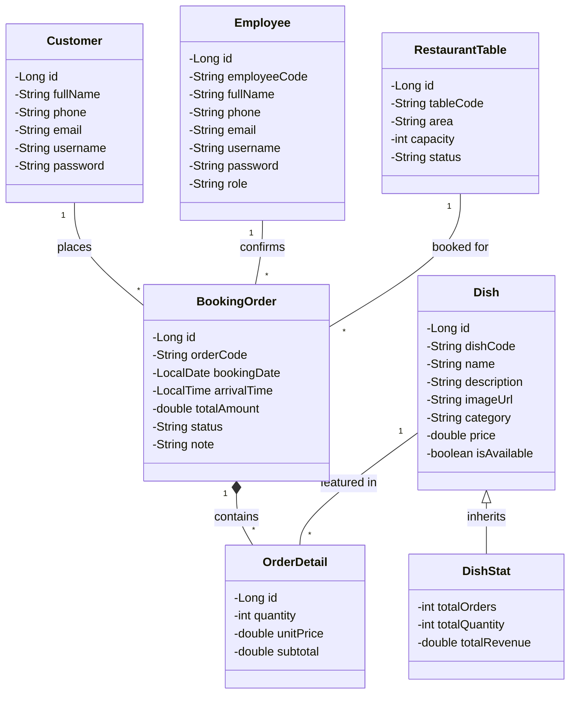

# I. Thiết kế biểu đồ lớp thực thể 

Hệ thống bao gồm các chức năng chính: Khách đặt bàn và/hoặc chọn món online, Quản lý bàn, Quản lý Món ăn. Hệ thống bao gồm các lớp thực thể:

- **Thực thể khách hàng -> Lớp Customer**: `id`, `fullName`, `phone`, `email`, `username`, `password`. Lớp `Customer` lưu tài khoản người dùng đăng nhập vào **Giao diện Khách hàng** để thực hiện tính năng tìm bàn, chọn món online.
- **Thực thể nhân viên/quản lý -> Lớp Employee**: `id`, `employeeCode`, `fullName`, `phone`, `email`, `username`, `password`, `role`. Lớp `Employee` lưu tài khoản người dùng đăng nhập vào **Giao diện Quản trị (Admin/Staff)**. Thuộc tính `role` dùng để **phân quyền**: người có vai trò MANAGER thì được thêm/sửa Bàn, Món ăn; nhân viên có vai trò STAFF thì thao tác xác nhận Đơn đặt bàn và thanh toán hóa đơn.
- **Thực thể bàn ăn -> Lớp RestaurantTable**: `id`, `tableCode`, `area`, `capacity`, `status`. Lớp `RestaurantTable` dùng để lưu thông tin về các bàn ăn vật lý trong nhà hàng, khu vực bố trí (Tầng 1, VIP...) và sức chứa tối đa. Thuộc tính `status` là kiểu chuỗi (String) dùng để lưu trạng thái bàn (VD: "AVAILABLE", "RESERVED", "OCCUPIED", "MAINTENANCE"). 
- **Thực thể món ăn -> Lớp Dish**: `id`, `dishCode`, `name`, `description`, `imageUrl`, `category`, `price`, `isAvailable`. Lớp `Dish` dùng để lưu thông tin danh mục thực đơn, hình ảnh và giá cả, phục vụ cho việc khách chọn món online và quản lý cập nhật thực đơn.
- **Thực thể đơn đặt -> Lớp BookingOrder**: `id`, `orderCode`, `customer`, `employee`, `restaurantTable`, `bookingDate`, `arrivalTime`, `totalAmount`, `status`, `note`. Lớp `BookingOrder` là bảng trung tâm của module đặt bàn trực tuyến. Thuộc tính `employee` lưu ID của nhân viên hoặc hệ thống đã tiếp nhận/xác nhận đơn này. Thuộc tính `status` là kiểu chuỗi (VD: "PENDING", "CONFIRMED", "COMPLETED", "CANCELLED").
- Một `BookingOrder` có nhiều `Dish` và một `Dish` xuất hiện trong nhiều `BookingOrder`, quan hệ giữa `BookingOrder` và `Dish` là n-n => đề xuất **lớp OrderDetail**: `id`, `bookingOrder`, `dish`, `quantity`, `unitPrice`, `subtotal`. Lớp `OrderDetail` dùng để lưu dòng chi tiết các món ăn đã gọi trong một đơn đặt. Trong đó `unitPrice` lưu đơn giá tại thời điểm đặt nhằm đảm bảo giá trên hóa đơn không thay đổi dù nhà hàng có cập nhật bảng giá trên thực đơn sau này.
- **Thực thể thống kê món ăn -> Lớp DishStat**: `totalOrders`, `totalQuantity`, `totalRevenue`. Lớp `DishStat` được tạo ra riêng cho module thống kê, đóng vai trò chứa dữ liệu kết quả tổng hợp (tổng số lần được gọi, tổng số lượng bán ra, tổng doanh thu) của từng món ăn trong một khoảng thời gian báo cáo. Lớp này kế thừa hoàn toàn thông tin từ lớp `Dish`.

**Quan hệ giữa các lớp thực thể:**
- `Customer` và `BookingOrder`: quan hệ 1 - n (một khách có thể tạo nhiều đơn)
- `Employee` và `BookingOrder`: quan hệ 1 - n (một nhân viên có thể xác nhận nhiều đơn đặt bàn)
- `RestaurantTable` và `BookingOrder`: quan hệ 1 - n (một bàn được phục vụ cho nhiều khách theo các khung giờ/lần đặt khác nhau)
- `BookingOrder` và `OrderDetail`: quan hệ 1 - n (một đơn đặt có nhiều dòng chi tiết gọi món)
- `Dish` và `OrderDetail`: quan hệ 1 - n (một món ăn xuất hiện trong nhiều dòng chi tiết đơn đặt khác nhau)
- `DishStat` và `Dish`: quan hệ Kế thừa. `DishStat` là lớp con của `Dish`.

---

# II. Bảng tóm tắt các lớp và thuộc tính (Dùng để vẽ trên Visual Paradigm)

### Bảng 1: Liệt kê các Lớp (Class) và Định dạng thuộc tính

| Tên Lớp (Class) | Phân loại (Stereotype) | Các Thuộc tính (Attributes) |
| --- | --- | --- |
| **Customer** | Class | - `id: Long` - `fullName: String` - `phone: String` - `email: String` - `username: String` - `password: String` |
| **Employee** | Class | - `id: Long` - `employeeCode: String` - `fullName: String` - `phone: String` - `email: String` - `username: String` - `password: String` - `role: String` |
| **RestaurantTable** | Class | - `id: Long` - `tableCode: String` - `area: String` - `capacity: int` - `status: String` |
| **Dish** | Class | - `id: Long` - `dishCode: String` - `name: String` - `description: String` - `imageUrl: String` - `category: String` - `price: double` - `isAvailable: boolean` |
| **BookingOrder** | Class | - `id: Long` - `orderCode: String` - `customer: Customer` - `employee: Employee` - `restaurantTable: RestaurantTable` - `bookingDate: LocalDate` - `arrivalTime: LocalTime` - `totalAmount: double` - `status: String` - `note: String` |
| **OrderDetail** | Class | - `id: Long` - `bookingOrder: BookingOrder` - `dish: Dish` - `quantity: int` - `unitPrice: double` - `subtotal: double` |
| **DishStat** | Class   *(Extends Dish)* | - `totalOrders: int` - `totalQuantity: int` - `totalRevenue: double` |

### Bảng 2: Liệt kê các mối quan hệ (Relationships)

| Lớp Nguồn (Source) | Loại Quan Hệ (Type) | Lớp Đích (Target) | Bản số (Multiplicity) | Ghi chú |
| --- | --- | --- | --- | --- |
| **Customer** | Association (1-n) | **BookingOrder** | 1 ... * | Một Customer có nhiều BookingOrder |
| **Employee** | Association (1-n) | **BookingOrder** | 1 ... * | Một Employee có thể duyệt/xác nhận nhiều BookingOrder |
| **RestaurantTable** | Association (1-n) | **BookingOrder** | 1 ... * | Một Table chứa nhiều BookingOrder |
| **BookingOrder** | Aggregation / Composition | **OrderDetail** | 1 ... * | Một BookingOrder bao gồm nhiều OrderDetail |
| **Dish** | Association (1-n) | **OrderDetail** | 1 ... * | Một Dish có trong nhiều OrderDetail |
| **DishStat** | Generalization (Kế thừa) | **Dish** | N/A | DishStat kế thừa từ Dish |

---

# III. Sơ đồ lớp thực thể (Class Diagram)
*Bạn có thể xem biểu đồ này trực tiếp trên các trình duyệt/editor hỗ trợ Markdown (như VS Code có extension Markdown Preview Mermaid Support) hoặc copy đoạn code sau dán vào [Mermaid Live Editor](https://mermaid.live/)*

